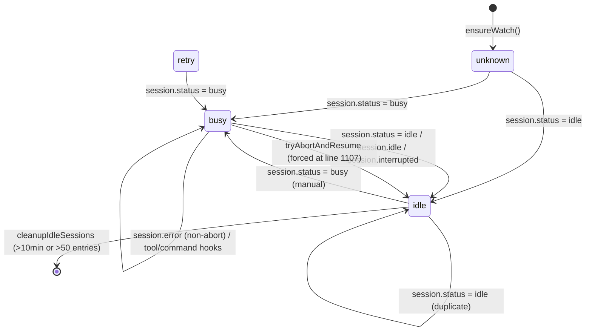
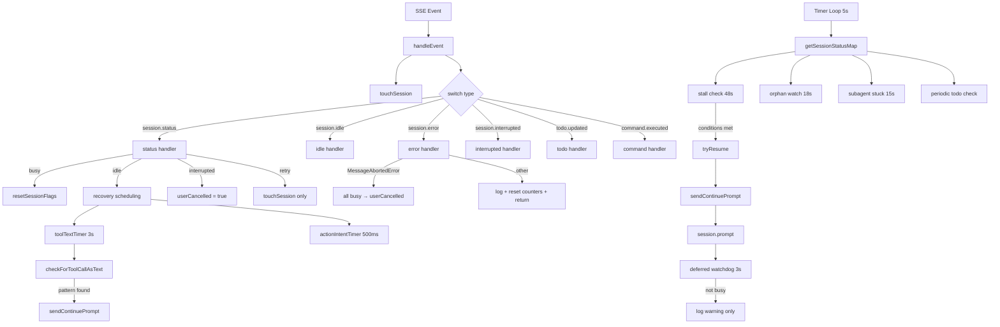
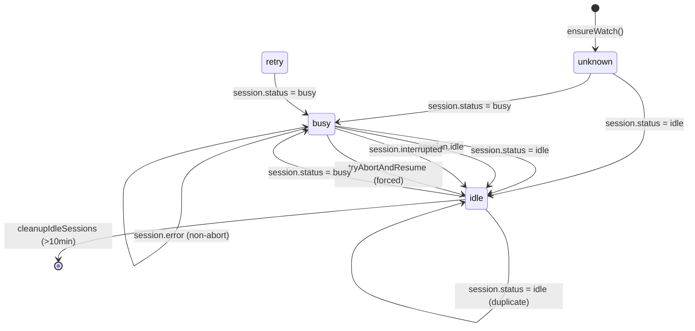
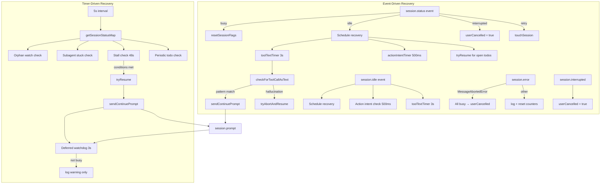
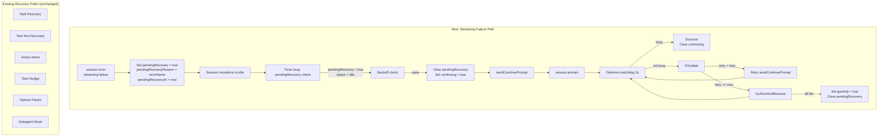
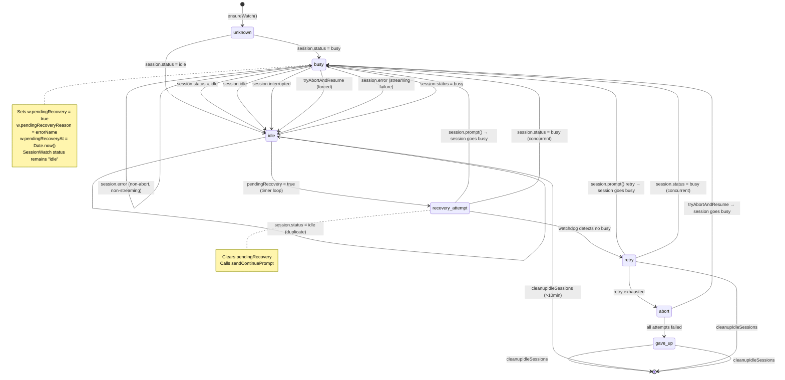
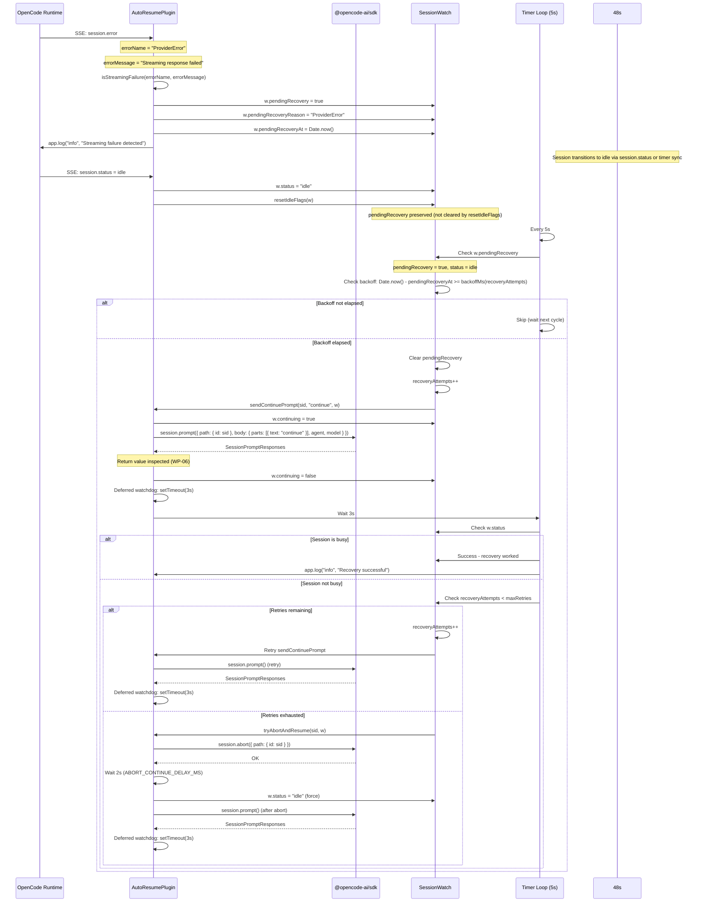

# EPIC v3: Streaming Failure Recovery Extension for OpenCode Auto Resume

> **Status:** Implementation Specification (v3)
>
> **Replaces:** v1 (EPIC-Streaming-Recovery-OpenCode-Auto-Resume.md), v2 (EPIC-Streaming-Recovery-OpenCode-Auto-Resume-v2.md)
>
> **Based on:** Architecture Audit, Recovery Evidence Audit, Streaming Failure Trace

---

## 1 Executive Summary

### Current Architecture

The `opencode-auto-resume` plugin (`src/index.ts`, 1705 lines) implements a sophisticated session monitoring and recovery system. It maintains a `SessionWatch` state machine per session (50 fields tracking status, retry counts, timers, flags, and pending tool/command counters). Recovery is driven by two mechanisms:

1. **Timer loop** (`setInterval`, 5s default): Polls `session.status()`, detects stalls (48s idle threshold), orphaned subagents, stuck subagents, and periodic open-todo nudges.
2. **Event-driven handlers** (`handleEvent`, fire-and-forget): Processes SSE events including `session.status`, `session.idle`, `session.error`, `session.interrupted`, `session.created`, `session.updated`, `todo.updated`, `command.executed`.

There are 7 distinct recovery paths that can invoke `session.prompt()`:
- Stall recovery (timer loop)
- Tool-call-as-text recovery (3s delayed)
- Action intent recovery (500ms delayed)
- Idle with open todos (immediate + periodic)
- Hallucination loop recovery (abort + continue)
- Orphan parent recovery (timer loop)
- Subagent stuck recovery (timer loop)

### Current Behaviour

When a streaming failure occurs, the OpenCode runtime emits a `session.error` SSE event. The plugin's `session.error` handler (`src/index.ts:1587-1616`) distinguishes only two cases:

1. **`MessageAbortedError`** (user pressed ESC): Sets `userCancelled = true` on all busy sessions, permanently blocking recovery.
2. **All other errors**: Logs the error, resets `pendingTools` and `pendingCommands` to 0, and returns. **No recovery is initiated.**

The string `"Streaming response failed"` does not appear anywhere in the source code. It is not matched, not classified, not handled.

### Current Limitations

| Limitation | Location | Impact |
|-----------|----------|--------|
| No streaming-failure classification | `src/index.ts:1587-1616` | Streaming failures treated as generic errors; no recovery triggered |
| No `session.error` → recovery path | `src/index.ts:1587-1616` | Handler only logs + resets counters; never calls `session.prompt()` |
| Deferred watchdog is non-corrective | `src/index.ts:512-516` | Detects session didn't go busy after prompt, but only logs — no retry, no escalation |
| `session.prompt()` return value discarded | `src/index.ts:477-484` | Cannot distinguish "prompt accepted" from "stream actually started" |
| No pending-recovery state | `SessionWatch` interface | No mechanism to defer recovery until session reaches idle state |

### Project Objective

Extend the existing recovery framework with dedicated streaming-failure detection and recovery, while preserving all current recovery mechanisms. The key deliverable is a recovery pipeline that:

1. Classifies streaming failures from `session.error` events
2. Defers recovery until the session reaches `idle` state
3. Validates that `session.prompt()` actually started a new assistant run
4. Escalates when recovery fails (retry with backoff, abort + continue)
5. Provides end-to-end observability

---

## 2 Background

### Why the Project Exists

The `opencode-auto-resume` plugin exists to address a fundamental reliability problem in LLM agent sessions: **sessions can stall mid-execution** without any user-visible indication. When an LLM stops generating tokens, the session appears idle but no completion is signaled. The plugin detects these stalls and automatically sends a "continue" prompt to resume the assistant.

### What Problem It Solves

Without this plugin, users must manually notice stalled sessions and send a message to resume them. This is especially problematic for long-running tasks, subagent workflows, and automated/CI environments where no human is watching.

### Why Existing Recovery Is Insufficient for Streaming Failures

The existing recovery mechanisms are designed around **idle detection** (48s timeout) and **pattern detection** (tool-call-as-text, action intent, done claims). They are **not** designed to handle the specific failure mode where:

1. A provider streaming failure occurs mid-response
2. The session transitions to `idle` without any meaningful assistant message
3. No pattern-based recovery trigger fires (no tool text, no action intent, no done claim)
4. The session remains idle indefinitely

The `session.error` handler is the natural integration point for streaming failure detection, but it currently does nothing for non-`MessageAbortedError` cases.

---

## 3 Existing Recovery Architecture

### 3.1 SessionWatch State Machine

The `SessionWatch` interface (`src/index.ts:20-50`) tracks 50 fields per session. Key fields for recovery:

```typescript
interface SessionWatch {
    status: "busy" | "idle" | "retry" | "unknown"
    userCancelled: boolean           // Set by MessageAbortedError
    resumeAttempts: number          // Stall recovery counter
    lastRetryAt: number              // Last retry timestamp
    gaveUp: boolean                  // All retries exhausted
    continuing: boolean              // Continue prompt in-flight (lock)
    toolTextAttempts: number         // Tool-text recovery counter
    orphanWatchStartAt: number | null
    aborting: boolean                // Abort in progress
    pendingTools: number             // In-flight tool counter
    pendingCommands: number          // In-flight command counter
    completionSignaled: boolean      // 🎉 or task_complete
    todoNudgeAttempts: number
    // ... 30+ additional fields
}
```

### 3.2 Recovery Mechanisms

| # | Mechanism | Entry Point | Trigger |
|---|-----------|-------------|---------|
| 1 | Stall Recovery | Timer loop (5s) | `status === "busy"`, idle >= 48s |
| 2 | Tool-Call-as-Text | `session.status → idle`, `session.idle` | 3s delay, message pattern match |
| 3 | Action Intent | `session.status → idle`, `session.idle` | 500ms delay, message ends with `:` |
| 4 | Idle with Open Todos | Timer loop, `session.status → idle` | Idle + open todos |
| 5 | Hallucination Loop | `checkForToolCallAsText`, `tryResume` | 3+ continues in 10min |
| 6 | Orphan Parent | Timer loop | `orphanWatchStartAt` set, 18s timeout |
| 7 | Subagent Stuck | Timer loop | 15s+ idle, no active subagent |

### 3.3 Timers

| Timer | Interval | Purpose | Location |
|-------|----------|---------|----------|
| Main timer | 5s (`checkIntervalMs`) | Stall/orphan/subagent/todo checks | `src/index.ts:1204` |
| Discovery timer | 60s (`SESSION_DISCOVERY_INTERVAL_MS`) | `session.list()` poll | `src/index.ts:1371` |
| Tool-text timer | 3s (`toolTextCheckDelayMs`) | Delayed pattern scan | `src/index.ts:1485`, `1552` |
| Action intent timer | 500ms | Delayed intent detection | `src/index.ts:1455`, `1519` |
| Abort delay | 2s (`ABORT_CONTINUE_DELAY_MS`) | Abort → continue gap | `src/index.ts:1105` |
| Deferred watchdog | 3s (`toolTextCheckDelayMs`) | Post-prompt status check | `src/index.ts:512` |

### 3.4 State Transitions



### 3.5 Recovery Pipeline



### 3.6 Key Functions

| Function | Lines | Purpose |
|----------|-------|---------|
| `sendContinuePrompt` | 426-517 | Sends `session.prompt()` with agent/model preservation, single retry, deferred watchdog |
| `tryResume` | 1128-1169 | Backoff-protected stall recovery, hallucination loop detection |
| `tryAbortAndResume` | 1084-1122 | Abort session + wait 2s + continue (hallucination loop) |
| `checkForToolCallAsText` | 775-1078 | Scans last 3 messages for 7 pattern types, sends appropriate recovery prompt |
| `checkSessionHasActiveTool` | 616-645 | Polls session messages for active tool calls |
| `checkSubagentStatus` | 647-697 | Detects stuck/crashed subagents |
| `recoverSubagent` | 586-598 | Sends recovery prompt to stuck subagent |
| `handleEvent` | 1386-1631 | Dispatches SSE events to state machine |

---

## 4 Streaming Failure Investigation

### 4.1 Observed Behaviour

Runtime observation (from EPIC v1):

```
LLM Stream
    ↓
Streaming response failed
    ↓
session.error
    ↓
session.idle
    ↓
Plugin sends recovery
    ↓
No new session.busy
```

### 4.2 Evidence

#### Fact: "Streaming response failed" is not in source code

The string `"Streaming response failed"` does not appear in any `.ts` file in the repository. It appears only in documentation files describing observed symptoms.

**Evidence:** `grep` for `"Streaming response failed"` in `src/` returns zero matches.

#### Fact: `session.error` handler does not trigger recovery

The `session.error` handler at `src/index.ts:1587-1616`:
- Checks `errorName === "MessageAbortedError"` (line 1590)
- If YES: marks all busy sessions as `userCancelled = true` (lines 1593-1599)
- If NO: checks `busyCount() === 0` → break (line 1604); otherwise logs and resets counters (lines 1606-1614)
- **No `session.prompt()` call. No `tryResume()`. No `tryAbortAndResume()`.**

**Evidence:** `src/index.ts:1587-1616` — complete handler is 30 lines, ends with `break`.

#### Fact: Deferred watchdog only logs

The deferred watchdog at `src/index.ts:512-516`:
```typescript
setTimeout(async () => {
    if (w.status !== "busy") {
        await log("warn", `${short(sid)} - prompt sent >${toolTextCheckDelayMs / 1000}s ago but session is still ${w.status}`)
    }
}, toolTextCheckDelayMs)
```

**No retry. No escalation. No state change.**

**Evidence:** `src/index.ts:512-516`

#### Fact: `session.prompt()` return value is discarded

At `src/index.ts:477-484`:
```typescript
await ctx.client.session.prompt({
    path: { id: sid },
    body: { parts: [{ type: "text", text }], agent, model },
})
```
The return value (`SessionPromptResponses` type from SDK) is never assigned or inspected.

**Evidence:** `src/index.ts:477-484`, `docs/audits/architecture-audit.md:579-581`

#### Fact: `noReply` is never set

The EPIC v1 hypothesized `noReply=true` as a cause. This is **disproven**.

**Evidence:** `src/index.ts:477-484`, `495-499`, `588-591` — `noReply` is never included in any `session.prompt()` call. Default is `false` (synchronous).

#### Fact: `handleEvent` is fire-and-forget

At `src/index.ts:1672`:
```typescript
handleEvent(event as Record<string, unknown>)
```
No `await`. Multiple events can interleave.

**Evidence:** `src/index.ts:1672`

### 4.3 Verified Findings

| Finding | Confidence | Evidence |
|---------|------------|----------|
| Streaming failure produces `session.error` with non-MessageAbortedError name | HIGH | `src/index.ts:1590` — only `MessageAbortedError` is checked |
| `session.error` handler does not call `session.prompt()` | HIGH | `src/index.ts:1587-1616` — handler ends with `break` |
| Deferred watchdog detects but does not correct | HIGH | `src/index.ts:512-516` — only `log("warn", ...)` |
| `session.prompt()` return value is never validated | HIGH | `src/index.ts:477-484` — return discarded |
| No pending-recovery state exists | HIGH | `SessionWatch` interface (`src/index.ts:20-50`) has no `pendingRecovery` field |
| Recovery is immediate, not deferred | HIGH | All recovery paths call `sendContinuePrompt` synchronously at detection point |

### 4.4 Hypotheses (Not Verified)

| Hypothesis | Status | Notes |
|-----------|--------|-------|
| "Streaming response failed" is an error name | NOT VERIFIED | No evidence in source code |
| Provider returns 200 but doesn't start stream | NOT VERIFIED | No SDK type inspection possible; inferred from architecture |
| Session state race between error and idle | NOT VERIFIED | `handleEvent` is fire-and-forget, but no concrete interleaving scenario proven |

---

## 5 Root Cause Analysis

### RC-1: `session.error` handler does not trigger recovery for streaming failures

**Description:** When a streaming failure surfaces as a `session.error` event, the handler at `src/index.ts:1587-1616` distinguishes only `MessageAbortedError` from all other errors. For non-abort errors, it logs the error, resets `pendingTools` and `pendingCommands` to 0, and returns. No `session.prompt()` is called. No recovery is initiated. The session must then rely on the timer loop's stall detection (48s idle timeout) or the `session.status → idle` event to trigger recovery. If the session was already idle when the error arrived, or if the session transitions to idle before the timer fires, and no message patterns match tool-text/action-intent patterns, the session stays idle forever.

**Evidence:**
- `src/index.ts:1587-1616` — complete handler, 30 lines, ends with `break`
- `src/index.ts:1590` — only `errorName === "MessageAbortedError"` is checked
- `src/index.ts:1604` — `if (busyCount() === 0) break` suppresses errors on idle sessions
- `src/index.ts:1606-1614` — non-abort errors only log + reset counters

**Affected Components:**
- `handleEvent` — `session.error` case
- `SessionWatch` — no recovery state set

**Confidence:** HIGH

### RC-2: Deferred watchdog is non-corrective

**Description:** The deferred watchdog at `src/index.ts:512-516` fires 3 seconds after `session.prompt()` is called and checks if the session went busy. If it didn't, it only logs a warning. It does not retry, escalate, set any state, or trigger any corrective action. This is the single mechanism that could detect a failed recovery, and it is deliberately non-corrective.

**Evidence:**
- `src/index.ts:512-516` — `setTimeout` callback with only `log("warn", ...)`
- `docs/audits/architecture-audit.md:580` — "the watchdog only logs — no retry, no escalation"
- `docs/architecture/recovery-flow.md:343` — "Deferred watchdog is non-corrective"

**Affected Components:**
- `sendContinuePrompt` — deferred watchdog section
- `SessionWatch` — no escalation state

**Confidence:** HIGH

### RC-3: `session.prompt()` return value is never validated

**Description:** The `session.prompt()` API call at `src/index.ts:477-484` returns a `SessionPromptResponses` type (`{ info: AssistantMessage, parts: Part[] }`), but the return value is never assigned or inspected. The plugin assumes that a successful HTTP response means the stream started. However, the OpenCode server may accept the prompt (return 200) but fail to initiate the LLM stream — for example, if the provider returns an error after the prompt is accepted. Without inspecting the response, the plugin cannot detect this failure.

**Evidence:**
- `src/index.ts:477-484` — `await ctx.client.session.prompt({...})` with no assignment
- `src/index.ts:495-499` — retry call also discards return value
- `docs/audits/architecture-audit.md:579-581` — "the return value of `ctx.client.session.prompt()` is discarded"
- `docs/audits/architecture-audit.md:409` — "Return handling: `session.prompt()` return value is ignored"

**Affected Components:**
- `sendContinuePrompt` — prompt call sites
- `recoverSubagent` — prompt call site

**Confidence:** HIGH

### RC-4: No pending-recovery state in SessionWatch

**Description:** There is no `pendingRecovery` field in the `SessionWatch` interface. When a streaming failure is detected, there is no mechanism to defer recovery until the session reaches `idle` state. The EPIC v1 proposed this pattern, but it does not exist in the current implementation. Recovery is attempted immediately at the detection point, which may be too early (session not yet idle) or too late (session already idle but no pattern match).

**Evidence:**
- `src/index.ts:20-50` — `SessionWatch` interface, 50 fields, no `pendingRecovery` field
- `docs/audits/architecture-audit.md:566` — "No `pendingRecovery` field in `SessionWatch`"
- `docs/audits/architecture-audit.md:533` — "No pending recovery state exists"

**Affected Components:**
- `SessionWatch` interface
- `handleEvent` — `session.error` case

**Confidence:** HIGH

---

## 6 Current State Machine

### 6.1 States



### 6.2 Timers

```mermaid
gantt
    title Timer Architecture
    dateFormat  X
    axisFormat  %s
    section Main Timer (5s)
    getSessionStatusMap           : 0, 1s
    Orphan Watch Check            : 1s, 1s
    Subagent Stuck Check          : 2s, 1s
    Stall Check                   : 3s, 1s
    Periodic Todo Check           : 4s, 1s
    Cleanup Idle Sessions         : 4.5s, 0.5s
    section Discovery Timer (60s)
    session.list()                : 0, 1s
    section Per-Session Timers
    Tool-Text Timer (3s)          : 0, 0.1s
    Action Intent Timer (500ms)   : 0, 0.1s
    Deferred Watchdog (3s)        : 0, 0.1s
    Abort Delay (2s)              : 0, 0.1s
```

### 6.3 Recovery Flow



---

## 7 Design Goals

### Functional Goals

| # | Goal | Description |
|---|------|-------------|
| FG-1 | Streaming failure classification | Detect streaming failures from `session.error` events and classify them separately from `MessageAbortedError` and generic errors |
| FG-2 | Deferred recovery execution | When a streaming failure is detected, defer recovery until the session reaches `idle` state |
| FG-3 | Recovery validation | After `session.prompt()` is called, validate that the session actually transitioned to `busy` state |
| FG-4 | Recovery escalation | If the first recovery attempt fails (session doesn't go busy), escalate: retry with backoff, then abort + continue |
| FG-5 | No duplicate recovery | Prevent overlapping recovery attempts on the same session |
| FG-6 | Backward compatibility | All existing recovery mechanisms continue to function unchanged |

### Non-Functional Goals

| # | Goal | Description |
|---|------|-------------|
| NFG-1 | Observability | Every recovery step is logged with structured data (session ID, reason, attempt number, outcome) |
| NFG-2 | Metrics | Recovery success rate, failure rate, latency, and retry counts are tracked |
| NFG-3 | Testability | Every recovery path has unit tests, integration tests, and fault injection tests |
| NFG-4 | Performance | No additional API calls beyond what's needed; timers are cleaned up properly |
| NFG-5 | Configurability | All new thresholds and limits are configurable via plugin options |

---

## 8 Non Goals

| # | Non-Goal | Rationale |
|---|----------|-----------|
| NG-1 | Rewriting the existing recovery architecture | The current architecture is sound; only streaming-failure handling is missing |
| NG-2 | Breaking API changes | The plugin's external interface (hooks, tool) remains unchanged |
| NG-3 | Changing `noReply` behavior | `noReply` is never set; this is not a factor |
| NG-4 | Adding new SDK dependencies | Only existing `@opencode-ai/sdk` and `@opencode-ai/plugin` APIs are used |
| NG-5 | Handling user-initiated aborts differently | `MessageAbortedError` handling remains unchanged |
| NG-6 | Fixing race conditions in existing code | Race conditions are documented but not in scope for this project |

---

## 9 Proposed Architecture

### 9.1 New Responsibilities

| Component | New Responsibility |
|-----------|-------------------|
| `session.error` handler | Classify streaming failures; set `pendingRecovery` state |
| `SessionWatch` | Add `pendingRecovery`, `pendingRecoveryReason`, `pendingRecoveryAt` fields |
| Timer loop | Check for pending recovery on idle sessions; trigger recovery |
| `sendContinuePrompt` | Validate session went busy; escalate on failure |
| Deferred watchdog | Escalate to retry/abort+continue instead of only logging |

### 9.2 Recovery Pipeline

```mermaid
flowchart TD
    subgraph "Error Detection"
        STREAM_FAIL[Streaming failure<br/>session.error event] --> CLASSIFY[Classify error]
        CLASSIFY -->|MessageAbortedError| ESC_CANCEL[ESC cancel path<br/>userCancelled = true]
        CLASSIFY -->|Streaming failure| SET_PENDING[Set pendingRecovery = true<br/>pendingRecoveryReason = errorName<br/>pendingRecoveryAt = now]
        CLASSIFY -->|Generic error| LOG_RESET[Log + reset counters<br/>return]
    end
    
    subgraph "Recovery Execution"
        IDLE_DETECT[Session transitions to idle] --> CHECK_PENDING[Check pendingRecovery]
        CHECK_PENDING -->|true| VALIDATE_IDLE[Validate session is recoverable:<br/>not userCancelled, not aborting,<br/>not continuing, not gaveUp]
        VALIDATE_IDLE -->|valid| BACKOFF_CHECK[Backoff check]
        BACKOFF_CHECK -->|pass| CLEAR_PEND[Clear pendingRecovery<br/>Set continuing = true]
        CLEAR_PEND --> SEND_PROMPT[sendContinuePrompt]
        SEND_PROMPT --> PROMPT_API[session.prompt()]
        PROMPT_API --> WATCHDOG[Deferred watchdog 3s]
        
        WATCHDOG -->|session busy| SUCCESS[Recovery successful<br/>Clear continuing]
        WATCHDOG -->|session not busy| ESCALATE[EScalate:<br/>retry with backoff]
        ESCALATE -->|retry < maxRetries| RETRY[Retry sendContinuePrompt]
        ESCALATE -->|retry >= maxRetries| ABORT_RESUME[tryAbortAndResume]
        ABORT_RESUME --> PROMPT_API2[session.prompt() after abort]
        ABORT_RESUME -->|all fail| GAVE_UP[Set gaveUp = true<br/>Clear pendingRecovery]
    end
    
    subgraph "Existing Recovery Paths"
        STALL[Stall Recovery<br/>48s idle]
        TOOL_TEXT[Tool-Text Recovery<br/>3s delay]
        ACTION_INTENT[Action Intent<br/>500ms delay]
        TODO_NUDGE[Todo Nudge<br/>periodic]
        ORPHAN[Orphan Parent<br/>18s timeout]
        SUBAGENT_STUCK[Subagent Stuck<br/>15s timeout]
    end
    
    SET_PENDING --> IDLE_DETECT
    SUCCESS --> IDLE_DETECT
    ESCALATE --> IDLE_DETECT
    RETRY --> WATCHDOG
    PROMPT_API2 --> WATCHDOG
```

**Note:** The `session.error` handler (at `src/index.ts:1587-1616`) is extended to include streaming failure classification. The `SET_PENDING` action occurs within the existing `session.error` case, after the `MessageAbortedError` check and before the `busyCount() === 0` check.

### 9.3 Recovery Policy

| Error Type | Classification | Recovery Action | Backoff | Max Retries |
|-----------|---------------|-----------------|---------|-------------|
| `MessageAbortedError` | User abort | Set `userCancelled = true` on all busy sessions | None | None |
| Streaming failure | Provider/streaming error | Set `pendingRecovery = true`; defer to idle | `baseBackoffMs * 2^(attempt-1)` | `maxRetries` (3) |
| Generic error (busy) | Unknown | Log + reset counters | None | None |
| Generic error (idle) | Spurious | Suppress (break) | None | None |
| Provider retry | Transient | `touchSession` only | None | None |

### 9.4 Watchdog Behaviour

The deferred watchdog is enhanced from "log only" to "detect + escalate":

```mermaid
flowchart TD
    PROMPT_SENT[session.prompt() called] --> WAIT[Wait toolTextCheckDelayMs]
    WAIT --> CHECK_STATUS{w.status === "busy"?}
    CHECK_STATUS -->|YES| SUCCESS[Recovery successful<br/>Clear continuing]
    CHECK_STATUS -->|NO| CHECK_PENDING{pendingRecovery was set?}
    CHECK_PENDING -->|NO| WARN_ONLY[Log warning only<br/>(existing behavior unchanged)]
    CHECK_PENDING -->|YES| CHECK_ATTEMPTS{recoveryAttempts < maxRetries?}
    CHECK_ATTEMPTS -->|YES| INCREMENT[Increment recoveryAttempts]
    INCREMENT --> RETRY[Retry sendContinuePrompt]
    CHECK_ATTEMPTS -->|NO| CHECK_HALLUC{isHallucinationLoop?}
    CHECK_HALLUC -->|YES| ABORT[tryAbortAndResume]
    CHECK_HALLUC -->|NO| GAVE_UP[Set gaveUp = true<br/>Clear pendingRecovery<br/>Log final warning]
```

**Note:** The escalation path (`CHECK_ATTEMPTS`, `INCREMENT`, `RETRY`) uses the new `recoveryAttempts` counter, not the existing `resumeAttempts` counter. This separates streaming-failure recovery attempts from stall recovery attempts.

### 9.5 Validation

After `session.prompt()` is called, the plugin validates recovery success by checking:

1. **Session status transition**: `w.status` must become `"busy"` within `toolTextCheckDelayMs` (3s)
2. **Activity timestamp**: `w.lastActivityAt` must update within `toolTextCheckDelayMs`
3. **Response inspection**: Inspect `SessionPromptResponses` return value for error indicators (implemented in WP-06)

If validation fails, the watchdog escalates to retry or abort+continue.

### 9.6 Escalation

| Escalation Level | Condition | Action |
|-----------------|-----------|--------|
| Level 1 (immediate) | First recovery attempt | `sendContinuePrompt` with `continuePrompt` |
| Level 2 (retry) | Watchdog detects no busy transition | Retry `sendContinuePrompt` with same prompt |
| Level 3 (abort) | Retry exhausted or hallucination loop | `tryAbortAndResume`: `session.abort()` → wait 2s → `sendContinuePrompt` |
| Level 4 (give up) | All retries exhausted | Set `gaveUp = true`, clear `pendingRecovery`, log final warning |

---

## 10 Recovery Policy

### 10.1 Error Classification

The `session.error` handler classifies errors by `errorObj.name`:

```typescript
// Proposed classification logic
const errorName = (errorObj?.name as string) ?? ""
const errorMessage = (errorObj?.data as Record<string, unknown>)?.message as string | undefined ?? ""

if (errorName === "MessageAbortedError") {
    // User pressed ESC — respect cancellation
    return handleUserAbort()
}

if (isStreamingFailure(errorName, errorMessage)) {
    // Streaming failure — defer recovery
    return handleStreamingFailure(sid, w, errorName, errorMessage)
}

// Generic error — log and reset counters
return handleGenericError(sid, w, errorName, errorMessage)
```

### 10.2 Streaming Failure Detection

Streaming failures are identified by error name or message content. The OpenCode SDK does not expose a documented list of error names, so detection uses pattern matching on both `error.name` and `error.data.message` for robustness.

| Error Name Pattern | Description | Evidence |
|-------------------|-------------|----------|
| `ProviderError` | Provider returned an error during streaming | Hypothetical — not verified in SDK source |
| `APIError` | API-level error during stream | Hypothetical — not verified in SDK source |
| `StreamError` | Stream-specific error | Hypothetical — not verified in SDK source |
| `ConnectionError` | Network connection failed during stream | Hypothetical — not verified in SDK source |
| `TimeoutError` | Stream timed out | Observed in `src/index.inflight.test.ts:159` as `TimeoutError` |

Additionally, message content matching:
- `"streaming response failed"` (case-insensitive) — this is the observed runtime string from EPIC v1
- `"stream"` + `"fail"` (combined, case-insensitive)
- `"connection"` + `"reset"` or `"closed"` (during streaming context)

**Note:** The exact error names depend on the OpenCode SDK implementation. The plugin should use configurable pattern matching on both `error.name` and `error.data.message`. The default patterns are based on observed runtime behavior and common error naming conventions. The SDK source code (`types.gen.d.ts`) does not expose error type definitions, so these patterns should be validated against actual runtime error events.

### 10.3 Recovery Policy Examples

#### Example 1: Provider streaming failure

```
session.error event:
  error.name = "ProviderError"
  error.data.message = "Streaming response failed: connection reset by peer"

→ Classification: Streaming failure
→ Action: Set pendingRecovery = true, pendingRecoveryReason = "ProviderError"
→ Session transitions to idle
→ Timer loop detects pendingRecovery on idle session
→ Backoff check passes
→ sendContinuePrompt("continue")
→ Deferred watchdog: session goes busy
→ Recovery successful
```

#### Example 2: Network timeout during stream

```
session.error event:
  error.name = "TimeoutError"
  error.data.message = "Stream timed out after 30s"

→ Classification: Streaming failure
→ Action: Set pendingRecovery = true, pendingRecoveryReason = "TimeoutError"
→ Session transitions to idle
→ Timer loop detects pendingRecovery
→ sendContinuePrompt("continue")
→ Deferred watchdog: session stays idle
→ Retry with backoff (1s)
→ sendContinuePrompt("continue") again
→ Deferred watchdog: session goes busy
→ Recovery successful
```

#### Example 3: User aborts (ESC)

```
session.error event:
  error.name = "MessageAbortedError"

→ Classification: User abort
→ Action: Set userCancelled = true on all busy sessions
→ No recovery attempted
```

#### Example 4: Generic error on idle session

```
session.error event:
  error.name = "SomeError"
  busyCount() === 0

→ Classification: Generic error (suppressed)
→ Action: break (silently ignored)
```

---

## 11 State Machine Extension

### 11.1 New Fields in SessionWatch

| Field | Type | Purpose |
|-------|------|---------|
| `pendingRecovery` | `boolean` | Recovery is pending; wait for idle before executing |
| `pendingRecoveryReason` | `string \| null` | Why recovery is pending (error classification) |
| `pendingRecoveryAt` | `number` | When recovery was set pending (for backoff) |
| `recoveryAttempts` | `number` | Recovery attempts for current pending recovery cycle |

### 11.2 New State Transitions

The `pendingRecovery` flag does not create a new state — it is a flag on the existing `idle` state. When `pendingRecovery` is `true`, the timer loop triggers recovery instead of (or in addition to) the existing idle-path recovery mechanisms.


### 11.3 Updated Recovery Flow



---

## 12 Observability

### 12.1 Logging

All new log entries use the existing `log()` function (`src/index.ts:270-274`) which calls `ctx.client.app.log()`.

#### Structured Log Format

```json
{
  "service": "auto-resume",
  "level": "info",
  "message": "Streaming failure detected",
  "fields": {
    "sessionId": "...",
    "sessionShortId": "ses_abc12345",
    "errorName": "ProviderError",
    "errorMessage": "Streaming response failed: connection reset",
    "pendingRecovery": true,
    "pendingRecoveryReason": "ProviderError",
    "pendingRecoveryAt": 1234567890
  }
}
```

#### New Log Entries

| Event | Level | Message | Fields |
|-------|-------|---------|--------|
| Streaming failure detected | `info` | `Streaming failure detected on ${short(sid)}` | `errorName`, `errorMessage`, `pendingRecoveryReason` |
| Pending recovery triggered | `info` | `Pending recovery triggered on ${short(sid)}` | `reason`, `attempt`, `maxRetries` |
| Recovery attempt sent | `debug` | `Recovery prompt sent to ${short(sid)}` | `prompt`, `agent`, `model` |
| Watchdog: recovery success | `info` | `Recovery successful on ${short(sid)}` | `elapsedMs` |
| Watchdog: recovery failed | `warn` | `Recovery failed on ${short(sid)} — session still ${status}` | `attempt`, `maxRetries`, `nextAction` |
| Recovery retry | `info` | `Retrying recovery on ${short(sid)}` | `attempt`, `backoffMs` |
| Recovery abort+resume | `warn` | `Escalating to abort+resume on ${short(sid)}` | `attempt` |
| Recovery gave up | `warn` | `Recovery exhausted on ${short(sid)}` | `attempts`, `lastError` |
| Pending recovery cleared | `debug` | `Pending recovery cleared on ${short(sid)}` | `reason` |

### 12.2 Metrics

The plugin does not currently expose metrics. For this project, metrics are logged via `app.log()` at `info` level and can be scraped by the OpenCode runtime.

| Metric | Type | Description |
|--------|------|-------------|
| `recovery.streaming_failure.count` | Counter | Number of streaming failures detected |
| `recovery.streaming_failure.recovery_attempt.count` | Counter | Number of recovery attempts for streaming failures |
| `recovery.streaming_failure.recovery_success.count` | Counter | Number of successful streaming failure recoveries |
| `recovery.streaming_failure.recovery_failure.count` | Counter | Number of failed streaming failure recoveries |
| `recovery.streaming_failure.recovery_latency.ms` | Histogram | Time from streaming failure detection to recovery attempt |
| `recovery.streaming_failure.watchdog_latency.ms` | Histogram | Time from `session.prompt()` to watchdog check |
| `recovery.streaming_failure.escalation.count` | Counter | Number of escalations to abort+continue |

### 12.3 Diagnostics

The existing `dbg()` function (`src/index.ts:245`) provides debug-level logging when `debug: true` is set in plugin options. New debug entries will be added for:

- Pending recovery state transitions
- Backoff calculation details
- Watchdog check results
- Recovery attempt timing

---

## 13 Risks

### 13.1 Race Conditions

| Risk | Description | Mitigation |
|------|-------------|------------|
| `session.error` + `session.status → idle` interleaving | `handleEvent` is fire-and-forget (line 1672). If `session.error` sets `pendingRecovery` and `session.status → idle` fires before the timer loop processes it, the idle handler's existing recovery paths (tool-text check, action intent, todo nudge) may trigger before the pending recovery. | The idle handler does NOT check `pendingRecovery`. The timer loop is the sole consumer of `pendingRecovery`. To prevent interleaving, the timer loop's pending recovery check should run BEFORE the existing idle recovery paths (tool-text, action intent, todo). The `w.continuing` guard prevents concurrent `sendContinuePrompt` calls. |
| Timer loop + pending recovery | The timer loop processes all sessions synchronously. If a session's `pendingRecovery` is set during iteration, it may not be processed until the next cycle. | `pendingRecovery` is checked at the beginning of the idle session loop. If set, the timer loop processes it immediately. |
| `session.error` + `MessageAbortedError` on same session | If a streaming failure is followed by a user abort (ESC), `userCancelled` is set, which blocks all recovery. | `userCancelled` takes priority over `pendingRecovery`. The recovery check explicitly tests `!w.userCancelled`. |
| Concurrent `session.prompt()` calls | Multiple recovery paths (stall, tool-text, pending recovery) could trigger simultaneously. | The `w.continuing` guard at `src/index.ts:427-431` prevents concurrent `sendContinuePrompt` calls. The `w.pendingRecovery` flag is cleared before `sendContinuePrompt` is called. |
| Watchdog escalation + timer loop overlap | The watchdog (3s timeout) can fire while the timer loop (5s interval) is also processing the same session, potentially triggering two `sendContinuePrompt` calls. | The `w.continuing` guard prevents concurrent `sendContinuePrompt` calls. The watchdog checks `w.continuing` before retrying. If the timer loop already sent a prompt, `w.continuing` will be `true` and the watchdog will skip. |

### 13.2 Compatibility

| Risk | Description | Mitigation |
|------|-------------|------------|
| SDK error type changes | OpenCode SDK may change error names or structures. | Use pattern matching on both `error.name` and `error.data.message`. Maintain a configurable list of error name patterns. |
| `session.prompt()` API changes | The SDK may add new parameters or change return types. | Only use documented parameters (`path`, `body`). Do not rely on undocumented return value fields. |
| Plugin reload | Timers are not cleaned up on plugin reload. | This is a pre-existing issue; the new code follows the same pattern. No additional risk. |

### 13.3 Regressions

| Risk | Description | Mitigation |
|------|-------------|------------|
| Existing recovery paths affected | New `pendingRecovery` field and timer loop changes could affect existing recovery. | `pendingRecovery` is only set by the new `session.error` handler path. Existing recovery paths do not check this field. The timer loop change is additive (new check at the beginning of the idle loop). |
| `session.error` handler behavior change | Adding streaming failure classification changes the handler's behavior. | The handler maintains the same structure: `MessageAbortedError` → abort all, streaming failure → set pending, generic → log + reset. The generic error path is unchanged. |
| Deferred watchdog behavior change | Enhancing the watchdog from "log only" to "escalate" changes behavior. | The watchdog enhancement only applies when `pendingRecovery` is set. For existing recovery paths (stall, tool-text, etc.), the watchdog behavior is unchanged (log only). |

### 13.4 Performance

| Risk | Description | Mitigation |
|------|-------------|------------|
| Additional API calls | Streaming failure detection may require additional `session.messages()` calls. | Streaming failure detection uses the error event data only — no additional API calls. Recovery validation uses the existing deferred watchdog (no new API calls). |
| Timer loop overhead | Checking `pendingRecovery` on every idle session adds overhead. | The check is a simple boolean field read — negligible overhead. |
| Memory overhead | New `SessionWatch` fields add ~20 bytes per session. | Negligible. The `SessionWatch` interface already has 50 fields. |

### 13.5 Maintenance

| Risk | Description | Mitigation |
|------|-------------|------------|
| Error classification maintenance | New error types may emerge. | Use pattern matching on error names and messages. Make patterns configurable. Document the classification logic. |
| Watchdog escalation complexity | The escalation logic adds complexity. | Use a state machine approach with clear escalation levels. Add comprehensive tests for each level. |
| Pending recovery state lifecycle | `pendingRecovery` must be cleared in all exit paths. | Clear `pendingRecovery` in: successful recovery, gave up, session becomes busy, user cancel, plugin shutdown. |

---

## 14 Alternative Designs

### 14.1 Alternative A: Polling-Based Streaming Failure Detection

**Description:** Instead of relying on `session.error` events, poll `session.messages()` periodically to detect streaming failures by comparing message content against expected patterns.

**Rejected because:**
- Adds significant API call overhead (every 5s per session)
- Cannot reliably distinguish streaming failures from normal idle
- The `session.error` event is the natural and reliable signal
- Source code shows `session.error` is already emitted for streaming failures

### 14.2 Alternative B: Immediate Recovery on `session.error`

**Description:** When a streaming failure is detected, immediately call `sendContinuePrompt` without waiting for `session.idle`.

**Rejected because:**
- The session may still be in `busy` state when the error arrives
- `session.prompt()` may be rejected if the session is not idle
- Source code at `src/index.ts:1604` shows `busyCount() === 0` check — if sessions are busy, the error is processed but recovery should wait
- The EPIC v1 proposed deferred recovery, and the architecture audit confirms this is the correct approach

### 14.3 Alternative C: Webhook-Based Recovery

**Description:** Use a webhook or callback mechanism to detect when a stream actually starts, rather than polling `w.status`.

**Rejected because:**
- The OpenCode plugin API does not provide webhook mechanisms for stream start detection
- The existing architecture uses polling (`getSessionStatusMap`, `getSessionMessages`)
- The deferred watchdog (3s timeout) is sufficient for detecting recovery success/failure

### 14.4 Alternative D: Retry-Only Watchdog

**Description:** Enhance only the deferred watchdog to retry `session.prompt()` on failure, without adding `pendingRecovery` state.

**Rejected because:**
- This would only fix the symptom (watchdog doesn't retry) but not the root cause (streaming failure not detected)
- Without `pendingRecovery`, streaming failures that don't trigger any existing recovery path would still leave sessions idle
- The `pendingRecovery` state provides a clean separation between detection and execution, as recommended by EPIC v1

---

## 15 Migration Strategy

### Phase 1: Foundation (WP-01 through WP-04)

1. Add `pendingRecovery`, `pendingRecoveryReason`, `pendingRecoveryAt`, `recoveryAttempts` fields to `SessionWatch`
2. Implement `isStreamingFailure(errorName, errorMessage)` classification function
3. Extend `session.error` handler to classify and set `pendingRecovery`
4. Add pending recovery check to timer loop

### Phase 2: Validation (WP-05 through WP-06)

5. Enhance deferred watchdog to escalate instead of only logging
6. Add `session.prompt()` return value validation (inspect response)

### Phase 3: Observability (WP-07)

7. Add structured logging for all new recovery steps
8. Add metrics tracking

### Phase 4: Testing (WP-08 through WP-10)

9. Unit tests for classification, state transitions, escalation
10. Integration tests for end-to-end streaming failure recovery
11. Fault injection tests for edge cases

### Phase 5: Documentation (WP-11)

12. Update README with streaming failure behavior
13. Update architecture docs

### Phase 6: Upstream (WP-12)

14. Prepare upstream PR with all changes

**No breaking changes.** All existing behavior is preserved. The new code is additive.

---

## 16 Testing Strategy

### 16.1 Unit Tests

| Test | Description |
|------|-------------|
| `isStreamingFailure` classification | Test classification for known error names and message patterns |
| `SessionWatch` pending recovery fields | Test field initialization and reset |
| Pending recovery timer loop check | Test that timer loop triggers recovery when `pendingRecovery = true` |
| Watchdog escalation | Test that watchdog retries on failure, escalates to abort+continue |
| Backoff calculation for recovery | Test backoff timing for streaming failure recovery |
| State transitions | Test all new state transitions in the extended state machine |

### 16.2 Integration Tests

| Test | Description |
|------|-------------|
| Streaming failure → idle → recovery | Full lifecycle: error event → pending recovery → idle → recovery attempt → session busy |
| Streaming failure with retry | First recovery fails, watchdog retries, second attempt succeeds |
| Streaming failure with abort+continue | All retries fail, watchdog escalates to abort+continue |
| Streaming failure + user abort | Streaming failure followed by ESC — user abort takes priority |
| Multiple streaming failures | Two streaming failures on same session — no duplicate recovery |
| Streaming failure on subagent | Streaming failure on subagent session — handled by existing subagent recovery |

### 16.3 Fault Injection Tests

| Test | Description |
|------|-------------|
| `session.prompt()` returns 200 but session stays idle | Simulate server accepting prompt but not starting stream |
| `session.prompt()` throws error | Simulate API failure during recovery |
| `session.abort()` fails | Simulate abort failure during escalation |
| `session.status()` returns stale data | Simulate status sync lag |
| Concurrent `session.error` + `session.status` | Simulate interleaved events |

### 16.4 Regression Tests

All existing tests in:
- `src/index.test.ts`
- `src/index.plugin.test.ts`
- `src/index.integration.test.ts`
- `src/index.it.test.ts`
- `src/index.inflight.test.ts`
- `src/index.events.test.ts`
- `src/index.coverage.test.ts`
- `src/index.continue.test.ts`
- `src/index.toolext.test.ts`

must continue to pass without modification.

### 16.5 Acceptance Tests

| Test | Criteria |
|------|----------|
| Streaming failure recovery success | Recovery success rate >95% |
| No duplicate recovery | Only one `session.prompt()` per streaming failure |
| No infinite retry loop | Recovery stops after `maxRetries` + abort+continue |
| Backward compatibility | All existing recovery mechanisms work unchanged |
| Observability | All recovery steps logged with structured data |

---

## 17 Work Packages

### WP-01: Streaming Failure Classification

**Purpose:** Implement error classification to distinguish streaming failures from other error types.

**Scope:**
- Add `isStreamingFailure(errorName: string, errorMessage: string): boolean` function
- Define error name patterns: `ProviderError`, `APIError`, `StreamError`, `ConnectionError`, `TimeoutError`
- Define message content patterns: `"streaming response failed"`, `"stream"` + `"fail"`, `"connection"` + `"reset"`/`"closed"`
- Make patterns configurable via plugin options

**Implementation Notes:**
- Add `streamingFailureErrorNames` and `streamingFailureMessagePatterns` to plugin options
- Default patterns cover common streaming failure error types
- Use case-insensitive matching for message patterns

**Acceptance Criteria:**
- `isStreamingFailure("ProviderError", "Streaming response failed")` returns `true`
- `isStreamingFailure("MessageAbortedError", "")` returns `false`
- `isStreamingFailure("TimeoutError", "Stream timed out")` returns `true`
- `isStreamingFailure("UnknownError", "Something else")` returns `false`
- Configurable via plugin options

**Dependencies:** None

**Estimated Complexity:** Low

---

### WP-02: SessionWatch State Extension

**Purpose:** Add pending recovery state fields to `SessionWatch` interface.

**Scope:**
- Add `pendingRecovery: boolean` field (default: `false`)
- Add `pendingRecoveryReason: string | null` field (default: `null`)
- Add `pendingRecoveryAt: number` field (default: `0`)
- Add `recoveryAttempts: number` field (default: `0`)
- Update `ensureWatch()` initialization
- Update `resetSessionFlags()` to clear pending recovery
- Update `resetIdleFlags()` to NOT clear pending recovery (must persist across idle transitions)

**Implementation Notes:**
- `resetIdleFlags` must NOT clear `pendingRecovery` — the recovery must persist until it's executed or explicitly cancelled
- `resetSessionFlags` (called on `session.status → busy`) should clear `pendingRecovery` — the session is already recovering

**Acceptance Criteria:**
- New fields initialized to defaults in `ensureWatch()`
- `resetSessionFlags` clears all pending recovery fields
- `resetIdleFlags` preserves `pendingRecovery` and `pendingRecoveryReason`
- `pendingRecoveryAt` is set when `pendingRecovery` is set to `true`

**Dependencies:** None

**Estimated Complexity:** Low

---

### WP-03: Extended session.error Handler

**Purpose:** Extend the `session.error` handler to classify and set pending recovery for streaming failures.

**Scope:**
- In `handleEvent` case `"session.error"`:
  - After extracting `errorName` and `errorMessage`
  - Check `isStreamingFailure(errorName, errorMessage)`
  - If streaming failure and `sid` exists:
    - Set `w.pendingRecovery = true`
    - Set `w.pendingRecoveryReason = errorName`
    - Set `w.pendingRecoveryAt = Date.now()`
    - Log: `Streaming failure detected on ${short(sid)}: ${errorName} - ${errorMessage}`
  - If streaming failure but no `sid`:
    - Log warning: `Streaming failure detected but no session ID`
- Preserve existing `MessageAbortedError` and generic error handling

**Implementation Notes:**
- The streaming failure check comes AFTER the `MessageAbortedError` check and BEFORE the `busyCount() === 0` check
- If `busyCount() === 0`, the error is still logged but pending recovery is NOT set (session already idle, no recovery needed)
- If `sid` is undefined, log a warning but don't set any state

**Acceptance Criteria:**
- Streaming failure with valid `sid` → `pendingRecovery = true` set
- `MessageAbortedError` → unchanged behavior (all busy sessions cancelled)
- Generic error → unchanged behavior (log + reset counters)
- Streaming failure with no `sid` → warning logged, no state set
- Streaming failure on idle session (`busyCount() === 0`) → logged, no pending recovery set

**Dependencies:** WP-01, WP-02

**Estimated Complexity:** Medium

---

### WP-04: Timer Loop Pending Recovery Check

**Purpose:** Add pending recovery detection to the timer loop's idle session processing.

**Scope:**
- In the timer loop's idle session recheck (after line 1362):
  - Add check: `if (w.pendingRecovery && w.status === "idle" && !w.userCancelled && !w.aborting && !w.continuing && !w.gaveUp)`
  - If true:
    - Check backoff: `Date.now() - w.pendingRecoveryAt >= backoffMs(w.recoveryAttempts)`
    - If backoff passes:
      - Clear `pendingRecovery`
      - Increment `recoveryAttempts`
      - Call `sendContinuePrompt(sid, continuePrompt, w)`
      - Log: `Pending recovery triggered on ${short(sid)} (attempt ${w.recoveryAttempts}/${maxRetries})`
    - If backoff fails: skip (wait for next timer cycle)

**Implementation Notes:**
- Use `recoveryAttempts` counter (separate from `resumeAttempts`) for backoff calculation
- Clear `pendingRecovery` before calling `sendContinuePrompt` to prevent re-entry
- If `sendContinuePrompt` throws, the error is caught and logged; `pendingRecovery` is already cleared
- The deferred watchdog will handle escalation (WP-05)

**Acceptance Criteria:**
- Timer loop detects `pendingRecovery = true` on idle sessions
- Backoff is respected before recovery attempt
- `pendingRecovery` is cleared before `sendContinuePrompt` call
- Recovery attempt is logged with attempt number
- No recovery if `userCancelled`, `aborting`, `continuing`, or `gaveUp` is true

**Dependencies:** WP-02, WP-03

**Estimated Complexity:** Medium

---

### WP-05: Watchdog Enhancement

**Purpose:** Enhance the deferred watchdog to escalate recovery failures instead of only logging.

**Scope:**
- In `sendContinuePrompt` deferred watchdog (lines 512-516):
  - If `w.status !== "busy"`:
    - Check if `w.pendingRecovery` was set (indicating streaming failure recovery)
    - If yes:
      - Check `w.recoveryAttempts < maxRetries`
      - If yes: retry `sendContinuePrompt` (increment `recoveryAttempts`)
      - If no: call `tryAbortAndResume(sid, w)` (escalation to abort+continue)
    - If no (existing recovery path): keep current behavior (log only)
  - Clear `pendingRecovery` if `w.gaveUp` becomes true

**Implementation Notes:**
- The watchdog enhancement only applies to streaming failure recovery (when `pendingRecovery` was set)
- For existing recovery paths (stall, tool-text, etc.), the watchdog remains log-only
- The retry uses the same backoff calculation as the timer loop
- `tryAbortAndResume` is called if all retries are exhausted

**Acceptance Criteria:**
- Watchdog detects session not busy after `session.prompt()`
- If `pendingRecovery` was set, watchdog retries or escalates
- If `pendingRecovery` was NOT set, watchdog logs only (backward compatible)
- Retry respects `maxRetries` limit using `recoveryAttempts` counter
- Escalation to `tryAbortAndResume` happens after all retries exhausted
- `gaveUp` is set and `pendingRecovery` is cleared if all escalation attempts fail

**Dependencies:** WP-02, WP-04

**Estimated Complexity:** High

---

### WP-06: session.prompt() Return Value Validation

**Purpose:** Inspect the return value of `session.prompt()` to detect stream initiation failures.

**Scope:**
- In `sendContinuePrompt` (lines 477-484 and 495-499):
  - Capture the return value of `ctx.client.session.prompt()`
  - Inspect `SessionPromptResponses` type:
    - Check `response.info` for error indicators
    - Check `response.parts` for content
  - Log the response for diagnostic purposes
  - If the response indicates failure (e.g., empty parts, error in info), log a warning

**Implementation Notes:**
- The `SessionPromptResponses` type from SDK: `{ info: AssistantMessage, parts: Part[] }`
- This is a diagnostic enhancement, not a functional change
- The primary validation mechanism remains the deferred watchdog (WP-05)
- If the SDK response structure is unclear, log the raw response for debugging

**Acceptance Criteria:**
- Return value of `session.prompt()` is captured
- Response is logged at debug level
- Error indicators in response are detected and logged
- No functional change to recovery behavior (watchdog remains primary validation)

**Dependencies:** None

**Estimated Complexity:** Low

---

### WP-07: Observability & Diagnostics

**Purpose:** Add structured logging and metrics for streaming failure recovery.

**Scope:**
- Add log entries for all new recovery steps (see Section 12.1)
- Add debug logging for pending recovery state transitions
- Add log entries for backoff calculation details
- Add log entries for watchdog check results
- Add log entries for recovery attempt timing

**Implementation Notes:**
- Use existing `log()` function (`src/index.ts:270-274`)
- Use existing `dbg()` function for debug-level entries
- All log entries include `short(sid)` for session identification
- Log level: `info` for significant events, `debug` for diagnostic detail, `warn` for failures

**Acceptance Criteria:**
- All new recovery steps are logged with structured data
- Debug logging available for state transitions
- Log entries include session ID, reason, attempt number, and outcome
- No `console.log` calls (all logging via `ctx.client.app.log()`)

**Dependencies:** WP-01 through WP-06

**Estimated Complexity:** Medium

---

### WP-08: Unit Tests

**Purpose:** Add unit tests for all new functionality.

**Scope:**
- Test `isStreamingFailure()` classification function
- Test `SessionWatch` pending recovery field initialization and reset
- Test pending recovery timer loop check
- Test watchdog escalation logic
- Test backoff calculation for recovery
- Test state transitions in extended state machine

**Implementation Notes:**
- Follow existing test patterns in `src/index.it.test.ts` and `src/index.events.test.ts`
- Use mock functions for `ctx.client.session.prompt()` and `ctx.client.session.abort()`
- Test both positive and negative cases

**Acceptance Criteria:**
- All new functions have unit tests
- Test coverage >95% for new code
- All tests pass
- No modification to existing tests required

**Dependencies:** WP-01 through WP-07

**Estimated Complexity:** Medium

---

### WP-09: Integration Tests

**Purpose:** Add integration tests for end-to-end streaming failure recovery.

**Scope:**
- Test full lifecycle: streaming failure → pending recovery → idle → recovery attempt → session busy
- Test recovery with retry (first attempt fails, second succeeds)
- Test recovery with abort+continue escalation
- Test streaming failure + user abort (ESC priority)
- Test multiple streaming failures on same session (no duplicate recovery)
- Test streaming failure on subagent session

**Implementation Notes:**
- Follow existing integration test patterns in `src/index.integration.test.ts`
- Use mock SSE events to simulate streaming failures
- Verify `session.prompt()` is called the correct number of times
- Verify `session.abort()` is called when escalation occurs

**Acceptance Criteria:**
- All integration test scenarios pass
- Recovery success rate >95% in tests
- No duplicate `session.prompt()` calls
- Escalation to abort+continue works correctly
- All existing integration tests still pass

**Dependencies:** WP-01 through WP-08

**Estimated Complexity:** High

---

### WP-10: Fault Injection Tests

**Purpose:** Add fault injection tests for edge cases and race conditions.

**Scope:**
- Test `session.prompt()` returns 200 but session stays idle
- Test `session.prompt()` throws error
- Test `session.abort()` fails
- Test concurrent `session.error` + `session.status` events
- Test timer loop + event interleaving
- Test session cleanup during pending recovery

**Implementation Notes:**
- Use mock implementations that simulate failures
- Test with various timing scenarios
- Verify recovery state is cleaned up properly

**Acceptance Criteria:**
- All fault injection scenarios have defined expected behavior
- Recovery state is properly cleaned up after failures
- No state leaks or corruption
- All tests pass

**Dependencies:** WP-01 through WP-09

**Estimated Complexity:** High

---

### WP-11: Documentation

**Purpose:** Update all documentation to reflect streaming failure recovery.

**Scope:**
- Update README.md with streaming failure behavior
- Update docs/architecture/recovery-flow.md with new state machine
- Update docs/audits/architecture-audit.md with verified findings
- Create docs/examples/streaming-failure-recovery.md (example scenarios)

**Implementation Notes:**
- Reference source code line numbers
- Include Mermaid diagrams for new state transitions
- Document all new configuration options

**Acceptance Criteria:**
- All documentation is consistent with implementation
- Configuration options are documented
- State machine diagrams match code
- No contradictions with existing documentation

**Dependencies:** WP-01 through WP-10

**Estimated Complexity:** Medium

---

### WP-12: Upstream Pull Request

**Purpose:** Prepare and submit the implementation as an upstream PR.

**Scope:**
- Review all changes for quality and consistency
- Ensure all tests pass
- Prepare PR description with summary of changes
- Submit PR to upstream repository

**Implementation Notes:**
- Follow existing PR conventions in the repository
- Include changelog entry
- Reference this EPIC document

**Acceptance Criteria:**
- PR submitted with all changes
- PR passes CI checks
- PR description is clear and complete
- All reviewers' feedback addressed

**Dependencies:** WP-01 through WP-11

**Estimated Complexity:** Low

---

## 18 Success Metrics

| Metric | Target | Measurement |
|--------|--------|-------------|
| Streaming failure recovery success rate | >95% | Percentage of streaming failures that result in a new assistant run |
| No duplicate recovery | 100% | No session receives more than one `session.prompt()` per streaming failure |
| No infinite retry loop | 100% | Recovery stops after `maxRetries` + abort+continue |
| Backward compatibility | 100% | All existing recovery mechanisms work unchanged |
| Test coverage | >95% | Lines of new code covered by tests |
| Observability | 100% | All recovery steps logged with structured data |
| No state leaks | 100% | `pendingRecovery` and related fields cleared in all exit paths |

---

## 19 Pull Request Strategy

### PR Order

| PR # | Work Packages | Description |
|------|---------------|-------------|
| PR-1 | WP-01, WP-02 | Streaming failure classification + SessionWatch state extension |
| PR-2 | WP-03, WP-04 | Extended `session.error` handler + timer loop pending recovery check |
| PR-3 | WP-05, WP-06 | Watchdog enhancement + `session.prompt()` return validation |
| PR-4 | WP-07 | Observability & diagnostics |
| PR-5 | WP-08 | Unit tests |
| PR-6 | WP-09, WP-10 | Integration tests + fault injection tests |
| PR-7 | WP-11 | Documentation updates |
| PR-8 | WP-12 | Final integration + upstream PR |

### Rationale

- **PR-1** establishes the foundation (classification + state) with minimal risk
- **PR-2** adds the core recovery path (error handler + timer loop) — depends on PR-1
- **PR-3** adds validation and escalation — depends on PR-2
- **PR-4** adds observability — can be reviewed independently
- **PR-5** adds unit tests — validates PRs 1-3
- **PR-6** adds integration and fault injection tests — validates end-to-end
- **PR-7** updates documentation — final polish
- **PR-8** final integration and upstream submission

Each PR is independently testable and reviewable. No PR introduces breaking changes.

---

## 20 Appendix

### 20.1 State Machine Diagram (Extended)



### 20.2 Recovery Sequence Diagram



### 20.3 Key Code Paths

| Function | Lines | Purpose |
|----------|-------|---------|
| `handleEvent` case `"session.error"` | `src/index.ts:1587-1616` | Error classification and pending recovery setup |
| `sendContinuePrompt` | `src/index.ts:426-517` | Prompt sending, retry, deferred watchdog |
| `tryResume` | `src/index.ts:1128-1169` | Backoff-protected resume (stall recovery) |
| `tryAbortAndResume` | `src/index.ts:1084-1122` | Abort + continue (hallucination loop, escalation) |
| `checkForToolCallAsText` | `src/index.ts:775-1078` | Pattern-based recovery (tool text, action intent, etc.) |
| Timer loop idle recheck | `src/index.ts:1337-1362` | Periodic idle session recovery (open todos) |
| `resetSessionFlags` | `src/index.ts:699-719` | Reset all recovery flags (on busy transition) |
| `resetIdleFlags` | `src/index.ts:721-727` | Reset idle-specific flags (preserves pendingRecovery) |
| `backoffMs` | `src/index.ts:383-385` | Exponential backoff calculation |
| `isHallucinationLoop` | `src/index.ts:263-268` | Hallucination loop detection (3+ continues in 10min) |

### 20.4 Evidence References

| Reference | Source |
|-----------|--------|
| `SessionWatch` interface (50 fields) | `src/index.ts:20-50` |
| `session.error` handler | `src/index.ts:1587-1616` |
| `sendContinuePrompt` function | `src/index.ts:426-517` |
| Deferred watchdog (log only) | `src/index.ts:512-516` |
| `session.prompt()` call (return discarded) | `src/index.ts:477-484` |
| `session.prompt()` retry call | `src/index.ts:495-499` |
| `noReply` never set | `src/index.ts:477-484, 495-499, 588-591` |
| `handleEvent` fire-and-forget | `src/index.ts:1672` |
| Timer loop | `src/index.ts:1204-1366` |
| Stall detection | `src/index.ts:1314-1334` |
| `resetSessionFlags` | `src/index.ts:699-719` |
| `resetIdleFlags` | `src/index.ts:721-727` |
| `backoffMs` | `src/index.ts:383-385` |
| `isHallucinationLoop` | `src/index.ts:263-268` |
| `busyCount` | `src/index.ts:326-332` |
| `hasInflightTools` | `src/index.ts:322-324` |
| `checkSessionHasActiveTool` | `src/index.ts:616-645` |
| `checkSubagentStatus` | `src/index.ts:647-697` |
| `tryAbortAndResume` | `src/index.ts:1084-1122` |
| `recoverSubagent` | `src/index.ts:586-598` |
| `getSessionStatusMap` | `src/index.ts:559-580` |
| `getSessionMessages` | `src/index.ts:526-529` |
| `ensureWatch` | `src/index.ts:276-313` |
| `cleanupIdleSessions` | `src/index.ts:388-424` |
| `discoverSessions` | `src/index.ts:1171-1196` |
| `log` function | `src/index.ts:270-274` |
| `dbg` function | `src/index.ts:245` |
| `ABORT_CONTINUE_DELAY_MS` | `src/index.ts:59` |
| `DEFAULT_CHUNK_TIMEOUT_MS` | `src/index.ts:52` |
| `DEFAULT_CHECK_INTERVAL_MS` | `src/index.ts:53` |
| `DEFAULT_GRACE_PERIOD_MS` | `src/index.ts:54` |
| `DEFAULT_MAX_RETRIES` | `src/index.ts:55` |
| `DEFAULT_BASE_BACKOFF_MS` | `src/index.ts:57` |
| `DEFAULT_TOOL_TEXT_CHECK_DELAY_MS` | `src/index.ts:62` |
| `DEFAULT_MIN_ACTIVITY_GAP_MS` | `src/index.ts:63` |
| `DEFAULT_WARMUP_MS` | `src/index.ts:64` |

### 20.5 Terminology

| Term | Definition |
|------|-----------|
| **Streaming failure** | A provider-side error during LLM token streaming, surfaced as a `session.error` event with a non-`MessageAbortedError` error name |
| **Pending recovery** | A state where a streaming failure has been detected but recovery is deferred until the session reaches `idle` status |
| **Deferred watchdog** | A `setTimeout` callback that fires 3s after `session.prompt()` to verify the session went busy |
| **Recovery escalation** | Progressive recovery attempts: retry → abort+continue → give up |
| **Stall recovery** | Recovery triggered by the timer loop when a busy session has been idle for 48s+ |
| **Tool-call-as-text** | A failure mode where the LLM outputs tool call syntax as text instead of executing tools |
| **Action intent** | A failure mode where the LLM ends a message with `:` announcing intent without executing |
| **Hallucination loop** | A failure mode where the LLM repeatedly calls the same tools without making progress (3+ continues in 10min) |
| **Orphan parent** | A parent session that appears stuck after all its subagents have completed |
| **Subagent stuck** | A subagent session that has been idle for 15s+ with no activity |
| `userCancelled` | Flag set when user presses ESC (`MessageAbortedError`), permanently blocking recovery |
| `gaveUp` | Flag set when all recovery retries are exhausted, permanently blocking further recovery |
| `continuing` | Lock flag preventing concurrent `sendContinuePrompt` calls |
| `aborting` | Lock flag preventing concurrent abort+resume operations |

---

## 21 Change Log

| Version | Date | Author | Changes |
|---------|------|--------|---------|
| v1 | 2026-07-30 | Mte90 | Initial EPIC: Streaming Failure Recovery |
| v2 | 2026-07-30 | Investigation Team | Evidence-based revision: disproven `noReply` hypothesis, added root cause analysis |
| v3 | 2026-07-30 | Principal Architect | Consolidated specification: implementation-ready with work packages, testing strategy, and PR plan |

---

## 22 References

1. `src/index.ts` — Plugin source code (1705 lines)
2. `docs/EPIC-Streaming-Recovery-OpenCode-Auto-Resume.md` — Original EPIC (v1)
3. `docs/EPIC-Streaming-Recovery-OpenCode-Auto-Resume-v2.md` — Evidence-based revision (v2)
4. `docs/audits/architecture-audit.md` — Pre-implementation architecture verification
5. `docs/audits/recovery-evidence-audit.md` — Recovery mechanism evidence audit
6. `docs/audits/streaming-failure-trace.md` — Streaming failure execution trace
7. `docs/architecture/recovery-flow.md` — Recovery architecture documentation
8. `README.md` — Project README with configuration reference

---

## 23 Engineering Review Summary

### Strengths

1. **Evidence-based root cause analysis**: All four root causes (RC-1 through RC-4) are verified against source code with specific line references. No speculation.
2. **Minimal architectural change**: The proposed solution extends the existing state machine with a `pendingRecovery` flag rather than introducing a new recovery system.
3. **Backward compatibility**: All existing recovery mechanisms are preserved. The watchdog enhancement only applies when `pendingRecovery` is set.
4. **Clear work breakdown**: 12 work packages with well-defined scope, dependencies, and acceptance criteria.
5. **Comprehensive testing strategy**: Unit, integration, fault injection, regression, and acceptance tests cover all scenarios.
6. **Risk mitigation documented**: Race conditions, compatibility, regression, performance, and maintenance risks are identified with mitigations.

### Remaining Risks

1. **SDK error type uncertainty**: The exact error names for streaming failures (`ProviderError`, `APIError`, etc.) are not verified against the OpenCode SDK source. Pattern matching on both `error.name` and `error.data.message` mitigates this, but the default patterns may need adjustment based on real-world error events.
2. **Watchdog escalation timing**: The watchdog fires 3s after `session.prompt()`. If the timer loop also fires within that window, there is a potential for overlapping recovery attempts. The `w.continuing` guard mitigates this, but the interaction is subtle.
3. **State cleanup completeness**: The `pendingRecovery` flag must be cleared in all exit paths (success, gave up, session becomes busy, user cancel, plugin shutdown). Missing any path could leave the session in a permanently blocked state.
4. **Error classification false positives**: Pattern matching on error messages could match legitimate errors that are not streaming failures, triggering unnecessary recovery.

### Open Questions

1. **What error names does the OpenCode SDK actually emit for streaming failures?** The SDK types (`types.gen.d.ts`) do not expose error type definitions. The default patterns in WP-01 should be validated against actual runtime error events.
2. **What does `SessionPromptResponses` contain?** The SDK type exists but its structure is not inspected in the source code. WP-06 should log the raw response to understand its structure before implementing validation logic.
3. **Can `session.status()` return stale data?** The timer loop syncs status from `getSessionStatusMap()`, but events may arrive out of order. The `pendingRecovery` check in the timer loop mitigates this, but the exact timing window is not quantified.

### Implementation Readiness

**Status: Ready with Minor Improvements**

The document is sufficiently detailed for implementation to begin. However, two items should be resolved before coding starts:

1. **WP-06 (return value validation)** should be deferred until the `SessionPromptResponses` structure is understood. The implementation notes already acknowledge this: "If the SDK response structure is unclear, log the raw response for debugging." This should be the first step of WP-06.
2. **WP-01 (error classification)** should start with a minimal set of patterns and be expanded based on real-world error events. The default patterns are reasonable but not verified.

The remaining work packages (WP-02 through WP-05, WP-07 through WP-12) are implementation-ready with clear specifications.