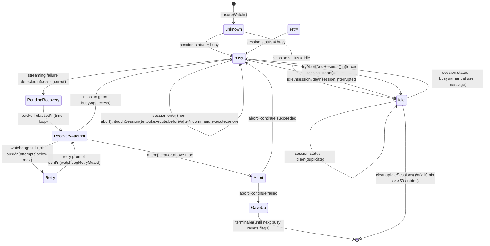
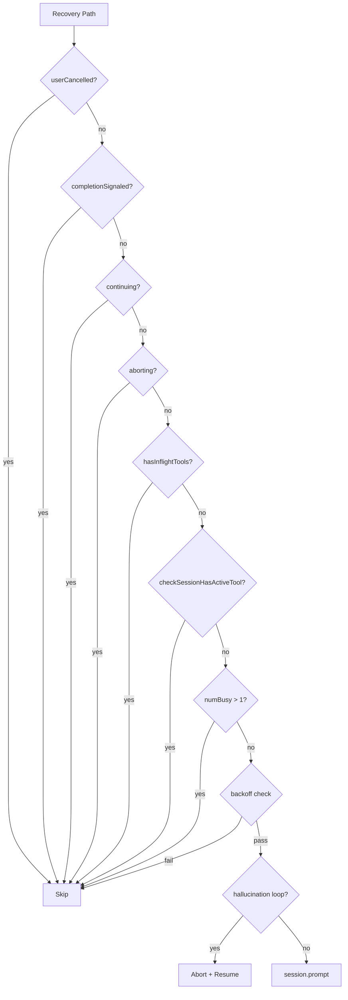

# Recovery Architecture — Current Implementation

**File:** `src/index.ts` (1959 lines)
**Version:** 1.1.4

This document describes the recovery architecture independently of the EPIC. It is based solely on source code analysis.

---

## 1. State Machine

### 1.1 `SessionWatch` Interface

```typescript
interface SessionWatch {
    createdAt: number                          // When watch was created
    lastActivityAt: number                    // Last event timestamp
    status: "busy" | "idle" | "retry" | "unknown"
    userCancelled: boolean                    // ESC or interrupt
    resumeAttempts: number                    // Stall retry count
    lastRetryAt: number                       // Last retry timestamp
    gaveUp: boolean                           // maxRetries exhausted
    orphanWatchStartAt: number | null         // Orphan parent detection
    aborting: boolean                         // Abort in progress
    toolTextRecovered: boolean                // Tool-text recovery done
    toolTextAttempts: number                  // Tool-text retry count
    continueTimestamps: number[]              // Hallucination loop detection
    idleSince: number | null                  // Idle timestamp
    continuing: boolean                       // Continue in progress (lock)
    todos: Todo[]                             // Cached todo list
    todoCheckAttempts: number                 // Todo verification count
    toolTextTimer: Timer | null               // Deferred check timer
    checkingToolText: boolean                 // Re-entrancy guard
    lastSubagentCheckAt: number               // Subagent check cooldown
    interruptedContinueCount: number           // Interrupted continue counter
    recentToolCalls: ToolCallRecord[]          // Tool call history (loop detection)
    toolLoopAttempts: number                   // Tool loop recovery count
    isSubagent: boolean                        // Flagged as subagent session
    completionSignaled: boolean                // task_complete or 🎉
    todoNudgeAttempts: number                  // Open-todos nudge count
    taskCompleteOverrides: number              // task_complete override count
    doneClaimNoTodosAttempts: number           // Done-claim verification count
    pendingTools: number                       // In-flight tool counter
    pendingCommands: number                    // In-flight command counter
    pendingRecovery: boolean                   // Streaming failure detected, recovery armed
    pendingRecoveryReason: string | null       // Error name that triggered the recovery
    pendingRecoveryAt: number                  // Detection timestamp (backoff anchor)
    recoveryAttempts: number                   // Streaming-failure recovery counter
    watchdogRetryGuard: boolean                // Watchdog retry in progress (keeps recovery armed)
}
```

### 1.2 State Transitions



The `PendingRecovery`/`RecoveryAttempt`/`Retry`/`Abort`/`GaveUp` states are recovery-cycle flags layered on top of the base `busy`/`idle`/`retry`/`unknown` status: `PendingRecovery` is armed while the session is still `busy`, and the actual recovery attempt only fires once the session reports `idle`.

### 1.3 Streaming Failure Recovery — State Definitions

| State | Description | Trigger | Next States |
|-------|-------------|---------|-------------|
| `PendingRecovery` (`pendingRecovery=true`) | Streaming failure detected, recovery armed | `session.error` classified as streaming failure while session busy | `RecoveryAttempt` |
| `RecoveryAttempt` (`recoveryAttempts >= 1`) | Actively attempting recovery (backoff wait, then recovery prompt) | Timer loop: session idle, backoff elapsed, `recoveryAttempts === 0` | `busy` (success), `Retry` (watchdog) |
| `Retry` (`watchdogRetryGuard=true`) | Retrying the failed recovery prompt via the deferred watchdog | Session still not busy 3s after prompt, `recoveryAttempts < maxRecoveryRetries` | `busy` (success), `RecoveryAttempt` (re-entry) |
| `Abort` (`aborting=true`) | Maximum retries exceeded, aborting session | `recoveryAttempts >= maxRecoveryRetries` | `busy` (success), `GaveUp` (failure) |
| `GaveUp` (`gaveUp=true`) | Gave up after max retries, terminal for this cycle | Abort+continue failed | `[*]` (until next `busy` resets flags) |

### 1.4 Streaming Failure Recovery — Transitions

| From State | To State | Trigger | Condition |
|------------|----------|---------|-----------|
| `busy` | `PendingRecovery` | Streaming failure detected | Error name in `streamingFailureErrorNames` OR message matches `streamingFailureMessagePatterns`; session busy; not `MessageAbortedError` |
| `PendingRecovery` | `RecoveryAttempt` | Timer loop (5s interval) | Status idle, `!userCancelled && !aborting && !continuing && !gaveUp && recoveryAttempts === 0`, backoff elapsed (`backoffMs(recoveryAttempts, baseBackoffMs, maxBackoffMs)`) |
| `RecoveryAttempt` | `busy` | Session goes busy | Prompt succeeded / user activity — `resetSessionFlags` clears all recovery fields |
| `RecoveryAttempt` | `Retry` | Deferred watchdog fires (3s after prompt) | Session still not busy, `recoveryAttempts < maxRecoveryRetries` |
| `Retry` | `RecoveryAttempt` | Retry prompt sent | `watchdogRetryGuard` keeps the recovery armed for the next watchdog pass |
| `RecoveryAttempt` | `Abort` | Deferred watchdog fires (3s after prompt) | `recoveryAttempts >= maxRecoveryRetries` — `pendingRecovery` cleared, escalation to `tryAbortAndResume` |
| `Abort` | `busy` | Abort+continue succeeded | `tryAbortAndResume` returns true |
| `Abort` | `GaveUp` | Abort+continue failed | `tryAbortAndResume` returns false, `!aborting` |
| `RecoveryAttempt` | `PendingRecovery` | Recovery prompt send fails | `recoveryAttempts` reset to 0, timer loop re-initiates the cycle |

### 1.5 Streaming Failure Recovery — Configuration

| Config Key | Type | Default | Description |
|------------|------|---------|-------------|
| `streamingFailureErrorNames` | `string[]` | `["ProviderError","APIError","StreamError","ConnectionError","TimeoutError"]` | Error names indicating streaming failure (exact, case-sensitive) |
| `streamingFailureMessagePatterns` | `string[]` | `["streaming response failed","stream.*fail","connection.*reset","connection.*closed"]` | Regex patterns matching streaming failure messages (case-insensitive; invalid regex falls back to substring match) |
| `maxRecoveryRetries` | `number` | `2` | Maximum streaming-failure recovery attempts before abort+resume escalation |
| `baseBackoffMs` | `number` | `1000` | Initial backoff delay (ms) |
| `maxBackoffMs` | `number` | `8000` | Maximum backoff delay cap (ms) |

Backoff formula: `backoffMs(attempt) = min(baseBackoffMs * 2^(attempt-1), maxBackoffMs)`.

---

## 2. Recovery Mechanisms

### 2.1 Stall Recovery

```
Trigger:  Timer loop (5s interval)
          w.status === "busy"
          w.userCancelled === false
          w.aborting === false
          orphanWatchStartAt === null
          numBusy === 1 (or 0, but only busy sessions are checked)
          idle >= chunkTimeoutMs + gracePeriodMs (default 48s)
          hasInflightTools(w) === false
          checkSessionHasActiveTool(sid) === false
          w.resumeAttempts < maxRetries

Action:   tryResume(sid, w, "Stream stall")
          → sendContinuePrompt(sid, continuePrompt, w)
          → session.prompt({ body: { parts: [{ text: "continue" }], agent, model } })

Backoff:  baseBackoffMs * 2^(resumeAttempts-1), capped at maxBackoffMs
          resumeAttempts incremented only on actual attempt (after backoff check)

Gate:     isHallucinationLoop(sid)? → tryAbortAndResume instead

Source:   Lines 1502-1523 (stall check), 1315-1356 (tryResume), 549-698 (sendContinuePrompt)
```

### 2.2 Tool-Call-as-Text Recovery

```
Trigger:  session.status → idle (line 1643) OR session.idle (line 1738)
          After toolTextCheckDelayMs (3s) delay
          w.toolTextRecovered === false
          w.toolTextAttempts < maxRetries

Action:   checkForToolCallAsText(sid, w)
          → getSessionMessages(sid), scan last 3 messages for:
            • 12 XML/JSON patterns (<function=, {"type":"function"}, etc.)
            • Truncated XML patterns (open without close)
            • Thinking-tool detection (tool call in reasoning part)
            • Tool loop detection (3+ same or pattern loop)
            • Ready-to-continue patterns
            • Done-claim patterns
            • Action-intent detection (message ends with ':')
          → sendContinuePrompt(sid, bestCandidate.prompt, w)
          → On hallucination loop: tryAbortAndResume instead

Source:   Lines 961-1268
```

### 2.3 Hallucination Loop Recovery

```
Trigger:  isHallucinationLoop(sid) returns true in:
          • checkForToolCallAsText (line 961)
          • tryResume (line 1315)
          Condition: continueTimestamps.length >= loopMaxContinues (default 3)
          within loopWindowMs (default 10min)
          hasInflightTools(w) === false
          checkSessionHasActiveTool(sid) === false

Action:   tryAbortAndResume(sid, w)
          → session.abort({ path: { id: sid } })
          → wait ABORT_CONTINUE_DELAY_MS (2s)
          → w.status = "idle" (force)
          → sendContinuePrompt(sid, continuePrompt, w)

Source:   Lines 336-350 (isHallucinationLoop), 1270-1309 (tryAbortAndResume)
```

### 2.4 Orphan Parent Recovery

```
Trigger:  Timer loop
          w.orphanWatchStartAt !== null
          idle >= subagentWaitMs + gracePeriodMs (default 18s)
          Set when: session.status → idle, prevBusyCount > 1, currentBusy === 1
          hasInflightTools(w) === false
          checkSessionHasActiveTool(sid) === false

Action:   checkSubagentStatus(sid)
          → subagent crashed? → recoverSubagent(stuckSid) or tryAbortAndResume(parent)
          → subagent idle? → tryAbortAndResume(parent)
          → subagent busy? → wait

Source:   Lines 1407-1457
```

### 2.5 Subagent Stuck Detection

```
Trigger:  Timer loop
          numBusy > 1 (line 1459 skip)
          lastActivityAt > 0
          idle > subagentWaitMs (15s)
          Real status !== "busy"
          hasInflightTools(w) === false
          checkSessionHasActiveTool(sid) === false
          Subagent check cooldown (10s)

Action:   checkSubagentStatus(sid)
          → idle/unknown: tryAbortAndResume(parent)
          → crashed + stuckSid: recoverSubagent(stuckSid)
            → session.prompt({ body: { parts: [{ text: SUBAGENT_RECOVERY_PROMPT }] } })
          → crashed + recovery failed: tryAbortAndResume(parent)

Source:   Lines 1459-1500, 767-878
```

### 2.6 Event-Driven Recovery Paths

| Event | Handler Action | Lines |
|-------|---------------|-------|
| `session.status` → busy | resetSessionFlags, touchSession | 1627-1634 |
| `session.status` → idle | resetIdleFlags, check todos, schedule tool-text check, action intent | 1643-1716 |
| `session.status` → interrupted | userCancelled=true, resetIdleFlags | 1635-1642 |
| `session.status` → retry | touchSession only | 1717-1720 |
| `session.idle` | resetIdleFlags, action intent, schedule tool-text check | 1738-1786 |
| `session.error` | Streaming failure → arm `pendingRecovery`; `MessageAbortedError` → all busy cancelled; else log | 1815-1867 |
| `session.interrupted` | userCancelled=true, resetIdleFlags, clear timer | 1788-1799 |
| `session.created` | ensureWatch, reset counters | 1724-1731 |
| `session.updated` | ensureWatch | 1733-1736 |
| `todo.updated` | Update cached todos | 1801-1813 |
| `command.executed` | resetSessionFlags all (clears `pendingRecovery`), decrement pendingCommands | 1869-1883 |

### 2.7 Streaming Failure Recovery (WP-01..WP-10)

```
Trigger:  session.error event
          isStreamingFailure(errorName, errorMessage,
                             streamingFailureErrorNames,
                             streamingFailureMessagePatterns) === true
          w.status === "busy"
          errorName !== "MessageAbortedError"

Action:   1. Arm recovery: w.pendingRecovery = true
              w.pendingRecoveryReason = errorName
              w.pendingRecoveryAt = Date.now()
          2. Timer loop (5s): pendingRecovery && status === "idle"
              && !userCancelled && !aborting && !continuing && !gaveUp
              && recoveryAttempts === 0
              && elapsed >= backoffMs(recoveryAttempts, baseBackoffMs, maxBackoffMs)
              → recoveryAttempts++ → sendContinuePrompt(sid, "continue", w)
          3. Deferred watchdog (toolTextCheckDelayMs = 3s after prompt):
              status still !== "busy"?
              → recoveryAttempts < maxRecoveryRetries
                  → recoveryAttempts++, watchdogRetryGuard = true
                    → sendContinuePrompt again (backoff logged)
              → recoveryAttempts >= maxRecoveryRetries
                  → pendingRecovery = false
                    → tryAbortAndResume(sid, w)   (abort → 2s wait → continue)
                    → fails && !aborting → gaveUp (recovery exhausted)
          4. Session goes busy → "Recovery successful"
              resetSessionFlags clears all recovery fields
              command.executed also clears pendingRecovery (user took over)

Cleared by: session.status → busy (resetSessionFlags)
            command.executed (resetSessionFlags)
            user abort (ESC / interrupted → userCancelled)

Source:   Lines 1815-1867 (detection), 1528-1562 (timer loop),
          648-697 (watchdog), 1270-1309 (abort+resume)
```

---

## 3. Guard System



---

## 4. Timer Architecture

```
┌─────────────────────────────────────────────────────┐
│ Timer Loop (checkIntervalMs: 5s)                     │
│  setInterval at line 1391                             │
│                                                       │
│  Per iteration:                                       │
│  ┌─────────────────────────────────────────────────┐ │
│  │ 1. getSessionStatusMap() → sync all statuses    │ │
│  │ 2. For each busy session:                       │ │
│  │    a. Orphan watch check (if orphanWatchStartAt)│ │
│  │    b. Subagent stuck check (if idle > 15s)      │ │
│  │    c. Stall check (if idle > 48s)               │ │
│  │ 3. For each idle session:                       │ │
│  │    a. Periodic idle recheck (open todos)        │ │
│  │ 4. cleanupIdleSessions()                        │ │
│  └─────────────────────────────────────────────────┘ │
│  timer.unref()                                        │
└─────────────────────────────────────────────────────┘

┌─────────────────────────────────────────────────────┐
│ Discovery Timer (SESSION_DISCOVERY_INTERVAL_MS: 60s) │
│  setInterval at line 1596                             │
│  discoverSessions() → session.list()                  │
│  Also runs once after 5s startup (line 1602)          │
│  discoveryTimer.unref()                                │
└─────────────────────────────────────────────────────┘

┌─────────────────────────────────────────────────────┐
│ Per-Session Timer (toolTextCheckDelayMs: 3s)         │
│  setTimeout per session, per idle event               │
│  Stored in w.toolTextTimer                            │
│  Cleared: on busy, on toolTextRecovered, on idle     │
│  Fires: checkForToolCallAsText(sid, w)               │
└─────────────────────────────────────────────────────┘
```

---

## 5. Recovery Chain Summary

```
Any event → touchSession(sid)
  ↓
session.status → busy?
  → resetSessionFlags
  → prevBusyCount updated
  ↓
session.status → idle?
  → orphan watch detection (prevBusyCount > 1 → now 1)
  → open todos check (immediate tryResume)
  → schedule tool-text check (3s)
  → schedule action intent check (500ms)
  ↓
Tool-text timer fires (3s)?
  → checkForToolCallAsText
    → scan messages for patterns
    → sendContinuePrompt (if pattern found)
    → tryAbortAndResume (if hallucination loop)
  ↓
Timer loop fires (5s)?
  → sync status from API
  → orphan watch path (if orphanWatchStartAt set)
  → subagent stuck path (if parent seems stuck)
  → stall path (if idle > 48s)
    → tryResume (with backoff)
    → tryAbortAndResume (if hallucination loop)
  → periodic idle recheck:
    → pending recovery path (if pendingRecovery && idle && backoff elapsed)
      → sendContinuePrompt
      → watchdog verifies → retry / escalate to abort+resume / gaveUp
    → open todos + busyCount=0
  → cleanup idle sessions
```

---

## 6. API Calls

| API | Call Site | Frequency | Parameters | Error Handling |
|-----|-----------|-----------|------------|---------------|
| `session.prompt()` | sendContinuePrompt | Per recovery | `{ path: { id }, body: { parts, agent, model } }` | Single retry, then throw |
| `session.prompt()` | recoverSubagent | Per stuck subagent | `{ path: { id }, body: { parts: [text] } }` | Returns false |
| `session.abort()` | tryAbortAndResume | Per hallucination loop | `{ path: { id } }` | Logs, returns false |
| `session.status()` | getSessionStatusMap | Every 5s timer cycle | None | Returns empty `{}` |
| `session.status()` | checkSubagentStatus | Every 10s per session | None | Returns `{ status: "unknown" }` |
| `session.status()` | checkSessionHasActiveTool | Per guard check | None | Returns false |
| `session.messages()` | getSessionMessages | Per sendContinuePrompt | `{ path: { id } }` | Caught in checkForToolCallAsText |
| `session.messages()` | checkForToolCallAsText | Per tool-text check | `{ path: { id } }` | Logged, returns |
| `session.list()` | discoverSessions | Every 60s | None | Logged |
| `app.log()` | log() | Per log call | `{ body: { service, level, message } }` | Silently ignored |

---

## 7. Constants

| Constant | Default | Purpose |
|----------|---------|---------|
| `chunkTimeoutMs` | 45000 | Inactivity timeout before stall detection |
| `gracePeriodMs` | 3000 | Extra wait before recovery action |
| `checkIntervalMs` | 5000 | Timer loop interval |
| `maxRetries` | 3 | Max recovery attempts per session |
| `baseBackoffMs` | 1000 | Initial backoff (doubles each attempt) |
| `maxBackoffMs` | 8000 | Maximum backoff cap |
| `subagentWaitMs` | 15000 | Orphan parent wait time |
| `loopMaxContinues` | 3 | Continues before hallucination abort |
| `loopWindowMs` | 600000 | Hallucination detection window (10min) |
| `toolTextCheckDelayMs` | 3000 | Delay before tool-text scan |
| `minActivityGapMs` | 1000 | Minimum gap between recovery attempts |
| `warmupMs` | 15000 | Session warmup period (suppress early action intent) |
| `ABORT_CONTINUE_DELAY_MS` | 2000 | Delay between abort and continue |
| `MAX_IDLE_SESSIONS` | 50 | Map size limit before cleanup |
| `IDLE_CLEANUP_MS` | 600000 | Idle session age before cleanup (10min) |
| `SESSION_DISCOVERY_INTERVAL_MS` | 60000 | session.list() poll interval |
| `streamingFailureErrorNames` | `["ProviderError","APIError","StreamError","ConnectionError","TimeoutError"]` | Error names that classify as streaming failures (exact match) |
| `streamingFailureMessagePatterns` | `["streaming response failed","stream.*fail","connection.*reset","connection.*closed"]` | Regex patterns (case-insensitive) indicating streaming failure |
| `maxRecoveryRetries` | 2 | Max streaming-failure recovery attempts before abort+resume |

---

## 8. Known Gaps

1. **`session.prompt()` response validation is observability-only** — `logPromptResponse()` (lines 523-547) inspects the response structure and logs empty-parts / error-indicator warnings, but takes no corrective action based on it
2. ~~**No streaming-failure detection**~~ — resolved (WP-02/WP-03): `isStreamingFailure()` classifies `session.error` events; see section 2.7
3. ~~**Deferred watchdog is non-corrective**~~ — resolved (WP-05): the watchdog now retries with backoff and escalates to abort+resume; see section 2.7
4. **No `noReply` parameter used** — all calls are synchronous (default)
5. **Fire-and-forget event dispatch** — line 1926 calls `handleEvent` without `await`, allowing interleaving
6. **Overlapping recovery paths** — 3+ independent paths can trigger `sendContinuePrompt` on the same session
7. **No plugin shutdown hook** — timers are never cleaned up on plugin unload
8. **Missing metrics** — no success/failure counters, no latency tracking
