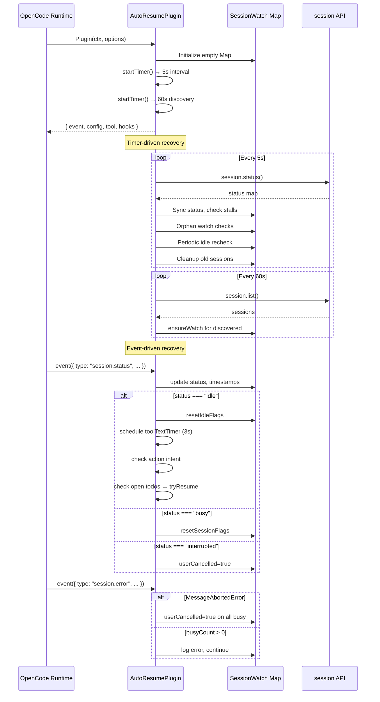
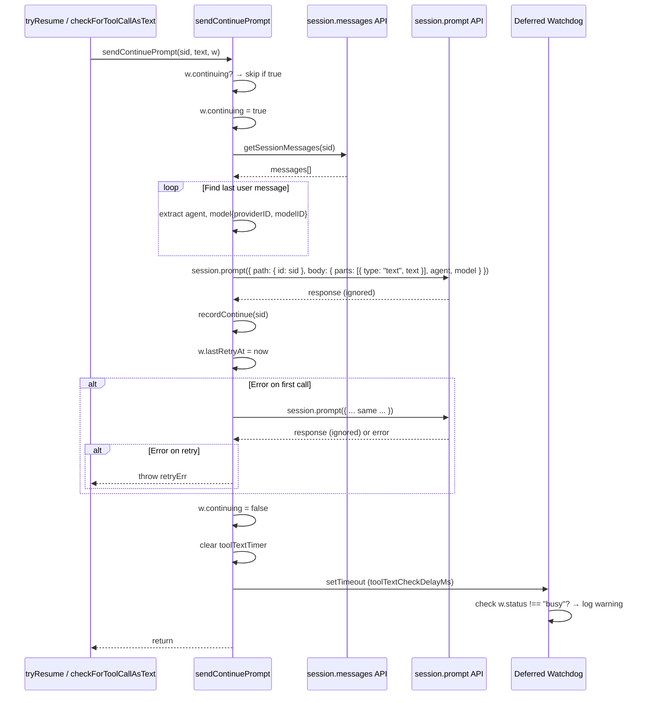

# Architecture Audit: opencode-auto-resume

**Date:** 2026-07-30
**Repository:** https://github.com/Mte90/opencode-auto-resume
**Version:** 1.1.4
**Audit Type:** Pre-implementation architecture verification

---

## Executive Summary

This audit verifies the design hypotheses in `docs/EPIC-Streaming-Recovery-OpenCode-Auto-Resume.md` against the actual implementation in `src/index.ts` (1705 lines) and its 9 test files (~4474 lines).

**Key finding:** The EPIC correctly identifies the symptom (recovery requests not consistently creating new assistant executions) but makes several incorrect assumptions about the implementation. The plugin already has a sophisticated recovery state machine with >15 distinct recovery mechanisms, and the specific gap is narrower than the EPIC suggests. The primary issue is not missing infrastructure but the fact that `session.prompt()` is called with `noReply` implicitly set to `false` (the default synchronous call), and the response/error from `session.prompt()` is not validated for actual stream initiation.

**Verdict:** 7 of 14 EPIC assumptions are NOT VERIFIED. The EPIC underestimates existing complexity and overestimates the scope of the fix. The most likely root cause is that `session.prompt()` succeeds (returns 200) but does not reliably start streaming — possibly because the session transitions state between detection and recovery.

---

## 1. Repository Architecture

### 1.1 Module Structure

```
opencode-auto-resume/
├── src/
│   ├── index.ts                         # Plugin implementation (1959 lines)
│   ├── index.test.ts                    # Utility function unit tests
│   ├── index.plugin.test.ts             # Plugin lifecycle tests
│   ├── index.integration.test.ts        # Integration tests with realistic mocks
│   ├── index.it.test.ts                 # Core logic and state machine tests
│   ├── index.inflight.test.ts           # In-flight tool/command tracking tests
│   ├── index.events.test.ts             # Event handling tests
│   ├── index.coverage.test.ts           # Tool-text regex coverage tests
│   ├── index.continue.test.ts           # Continue behavior tests
│   ├── index.toolext.test.ts            # Tool-call-as-text detection tests
│   ├── index.streaming-failure.test.ts  # Streaming failure classification tests (WP-02/WP-03)
│   ├── index.backoff.test.ts            # Exponential backoff tests (WP-04)
│   ├── index.pending-recovery.test.ts   # Pending recovery timer loop tests (WP-04)
│   ├── index.state-machine.test.ts      # Extended state machine transition tests (WP-05)
│   ├── index.watchdog.test.ts           # Deferred watchdog retry/escalation tests (WP-05)
│   ├── index.session-error.test.ts      # session.error streaming classification tests (WP-06)
│   ├── index.prompt-response.test.ts    # session.prompt() response validation tests (WP-06)
│   └── index.session-watch.test.ts      # SessionWatch recovery field tests (WP-05)
├── docs/
│   ├── EPIC-Streaming-Recovery-OpenCode-Auto-Resume.md
│   ├── EPIC-Streaming-Recovery-OpenCode-Auto-Resume-v2.md
│   ├── EPIC-Streaming-Recovery-OpenCode-Auto-Resume-v3.md
│   ├── architecture/recovery-flow.md
│   ├── audits/architecture-audit.md
│   ├── audits/recovery-evidence-audit.md
│   ├── audits/streaming-failure-trace.md
│   ├── examples/streaming-failure-recovery.md
│   └── workpackages/
├── package.json
├── tsconfig.json
├── bunfig.toml
└── README.md
```

### 1.2 Architecture Diagram

```mermaid
graph TB
    subgraph "OpenCode Runtime"
        SSE[SSE Event Stream]
        API[session.prompt API<br/>POST /session/{id}/message]
        STATUS[session.status API]
    end

    subgraph "AutoResumePlugin"
        EH[event hook<br/>handleEvent]
        CL[config hook]
        TC[task_complete tool]
        TEB[tool.execute.before hook]
        TEA[tool.execute.after hook]
        CEB[command.execute.before hook]

        subgraph "State Machine"
        SM[SessionWatch Map<br/>key: sessionID]
        end

        subgraph "Timers"
        T1[checkIntervalMs<br/>5s timer loop]
        T2[discoveryTimer<br/>60s session.list]
        T3[toolTextTimer<br/>3s delay per session]
        end

        subgraph "Recovery Mechanisms"
        SR[Stall Recovery<br/>chunkTimeout + gracePeriod]
        TTR[Tool-Text Recovery<br/>XML/JSON pattern scan]
        HR[Hallucination Recovery<br/>abort + continue]
        OR[Orphan Parent Recovery<br/>subagentWaitMs]
        SSR[Subagent Stuck Recovery<br/>60s/3min timeout]
        AIR[Action Intent Recovery]
        DCR[Done-Claim Verification]
        TCR[Todo-Completion Recovery]
        end

        subgraph "Guards"
        BT[busyCount > 1 guard]
        IT[hasInflightTools guard]
        AT[checkSessionHasActiveTool guard]
        UC[userCancelled guard]
        CS[completionSignaled guard]
        end
    end

    SSE --> EH
    EH --> SM
    T1 --> SM
    SM --> BT
    SM --> IT
    SM --> UC
    SM --> CS
    BT --> SR
    IT --> SR
    AT --> SR
    SR --> API
    TTR --> API
    HR --> API
    OR --> API
    SSR --> API
    AIR --> API
    DCR --> API
    TCR --> API
    API --> STATUS
```

### 1.3 Dependency Graph

```mermaid
graph LR
    subgraph "External"
        SDK[@opencode-ai/sdk]
        PLUGIN[@opencode-ai/plugin]
    end

    subgraph "Plugin"
        INDEX[index.ts]
    end

    subgraph "Types"
        TT[ToolCallRecord]
        TW[SessionWatch]
        TD[Todo]
    end

    subgraph "Test Suite"
        PLTEST[index.plugin.test.ts]
        EVTEST[index.events.test.ts]
        INTTEST[index.integration.test.ts]
        ITTEST[index.it.test.ts]
        INFTEST[index.inflight.test.ts]
        CTEST[index.continue.test.ts]
        TOTEST[index.toolext.test.ts]
        UTEST[index.test.ts]
        COVTEST[index.coverage.test.ts]
    end

    SDK --> INDEX
    PLUGIN --> INDEX
    INDEX --> TT
    INDEX --> TW
    INDEX --> TD
    INDEX --> PLTEST
    INDEX --> EVTEST
    INDEX --> INTTEST
    INDEX --> ITTEST
    INDEX --> INFTEST
    INDEX --> CTEST
    INDEX --> TOTEST
    INDEX --> UTEST
    INDEX --> COVTEST
```

### 1.4 Plugin Lifecycle



### 1.5 Module Responsibilities

| Component | Responsibility | Lines | Complexity |
|-----------|---------------|-------|------------|
| `handleEvent` | Dispatch SSE events to state machine | 1386-1631 | High: 10 event types |
| `sendContinuePrompt` | Send `session.prompt()` with agent/model preservation | 426-517 | High: retry, deferred check |
| `checkForToolCallAsText` | Scan messages for tool-as-text patterns | 775-1078 | Very high: 7 pattern types |
| `tryResume` | Normal stall recovery with backoff | 1128-1169 | Medium |
| `tryAbortAndResume` | Abort session + continue (hallucination loop) | 1084-1122 | Medium |
| `checkSessionHasActiveTool` | Polling guard against mid-tool abort | 616-645 | Low |
| `checkSubagentStatus` | Detect stuck/crashed subagents | 647-697 | Medium |
| `cleanupIdleSessions` | Prevent memory leaks | 388-424 | Low |
| `discoverSessions` | Poll session.list() for missed sessions | 1171-1196 | Low |
| Timer loop `startTimer()` | Drive periodic checks every 5s | 1202-1378 | Very high |

---

## 2. Recovery Architecture

### 2.1 Recovery Mechanism Inventory

| # | Mechanism | Entry Point | Trigger | Status Verification |
|---|-----------|-------------|---------|-------------------|
| 1 | **Stall Recovery** | Timer loop line 1315 | `idle >= chunkTimeoutMs + gracePeriodMs` (48s) | ✅ VERIFIED (lines 1314-1334) |
| 2 | **Tool-Call-as-Text Recovery** | `session.status.idle` / `session.idle` handler, line 1484-1487 | Idle after 3s delay, XML/JSON pattern match | ✅ VERIFIED (lines 1484-1487) |
| 3 | **Hallucination Loop (abort+continue)** | `checkForToolCallAsText` and `tryResume` | `isHallucinationLoop` => >=3 continues in 10min | ✅ VERIFIED (lines 263-268, 1050-1062, 1138-1153) |
| 4 | **Tool Loop Detection** | `trackToolCall` in `checkForToolCallAsText` | 3+ same tool consecutively or pattern loop | ✅ VERIFIED (lines 760-773) |
| 5 | **Orphan Parent Recovery** | Timer loop line 1220 | `busyCount` drops from >1 to 1, `subagentWaitMs` + `gracePeriodMs` | ✅ VERIFIED (lines 1220-1268) |
| 6 | **Subagent Stuck Recovery** | Timer loop line 1277 | No new text >1min (>3min with tool call) | ✅ VERIFIED (lines 1277-1312) |
| 7 | **Action Intent Recovery** | `session.idle` handler 1518-1545 + `checkForToolCallAsText` 971-990 | Message ending with `:` | ✅ VERIFIED |
| 8 | **Ready-to-Continue Auto Resume** | `checkForToolCallAsText` 908-943 | "ready to continue with task" patterns | ✅ VERIFIED |
| 9 | **Done-Claim Verification** | `checkForToolCallAsText` 948-967 | Done claim + open todos | ✅ VERIFIED |
| 10 | **Idle-with-Open-Todos** | `session.status.idle` handler 1431-1449 + periodic recheck 1338-1362 | Idle + open todos + busyCount=0 | ✅ VERIFIED |
| 11 | **ESC Cancel** | `session.error` / `session.interrupted` | `MessageAbortedError` | ✅ VERIFIED (lines 1587-1616, 1560-1571) |
| 12 | **🎉 Completion Detection** | `checkForToolCallAsText` 992-1000 + idle handler 1436-1442 | Assistant message ending with 🎉 | ✅ VERIFIED |
| 13 | **`task_complete` Tool** | Tool execution 1637-1660 | Agent calls tool | ✅ VERIFIED |
| 14 | **Thinking-Tool Recovery** | `checkForToolCallAsText` 842-844, 898-905 | Tool call in reasoning part | ✅ VERIFIED |
| 15 | **Session Discovery** | `discoveryTimer` 1371-1374 | Every 60s `session.list()` | ✅ VERIFIED |
| 16 | **Idle Session Cleanup** | Timer loop 1365 | >10min idle or >50 entries | ✅ VERIFIED |

### 2.2 Detailed Recovery Flow: Stall Recovery (Primary Path)

```
Timer loop (5s)
  └─ for each busy session:
      └─ statusMap[sid] sync
      └─ w.status !== "busy" → skip
      └─ w.userCancelled → skip
      └─ w.aborting → skip
      └─ orphanWatchStartAt !== null → orphan path
      └─ numBusy > 1 → skip (subagent guard)
      └─ idle = now - w.lastActivityAt
      └─ idle >= chunkTimeoutMs + gracePeriodMs?
          ├─ hasInflightTools(w)? → skip (active tool guard)
          ├─ checkSessionHasActiveTool(sid)? → skip (polling guard)
          ├─ w.resumeAttempts < maxRetries?
          │   └─ tryResume(sid, w, "Stream stall")
          │       └─ backoff check (elapsed >= baseBackoff * 2^(attempt-1))
          │       └─ isHallucinationLoop? → abort path
          │       └─ sendContinuePrompt(sid, prompt, w)
          │           └─ w.continuing guard
          │           └─ getSessionMessages → extract agent/model
          │           └─ ctx.client.session.prompt({ path: { id }, body: { parts, agent, model }})
          │           └─ on error: retry once
          │           └─ deferred check: setTimeout → verify session went busy
          └─ w.resumeAttempts >= maxRetries → gaveUp = true
```

### 2.3 Entry Points for Recovery

| Entry Point | Location | Type |
|-------------|----------|------|
| Timer loop (5s) | Lines 1202-1366 | Periodic |
| `session.status` → idle | Lines 1415-1488 | Event-driven |
| `session.idle` | Lines 1510-1558 | Event-driven |
| `session.error` | Lines 1587-1616 | Event-driven |
| `session.interrupted` | Lines 1560-1571 | Event-driven |
| `session.created` | Lines 1496-1503 | Event-driven |
| `session.updated` | Lines 1505-1508 | Event-driven |
| `todo.updated` | Lines 1573-1585 | Event-driven |
| `command.executed` | Lines 1618-1629 | Event-driven |
| `session.list()` discovery | Lines 1171-1196 | Periodic |
| Session discovery (initial) | Line 1377 | One-shot after 5s |

---

## 3. Event System

### 3.1 `session.error`

**Occurrences:**

| Location | Lines | Purpose |
|----------|-------|---------|
| `handleEvent` case `"session.error"` | 1587-1616 | Main handler |

**How it works:**
1. Extracts error object via `getError(ev)` which checks `ev.error` or `props.error`
2. Checks `errorName === "MessageAbortedError"`:
   - If YES: iterates ALL sessions, marks `busy` sessions as `userCancelled=true`, sets status to `idle`, calls `resetIdleFlags`. This is the ESC cancel path.
   - If NO: checks `busyCount() === 0` → breaks early (suppresses spurious errors on idle sessions).
   - Otherwise: logs the error, resets `pendingTools` and `pendingCommands` to 0 on the affected session.

**Interaction with other events:**
- `session.error` + `MessageAbortedError` → prevents all recovery via `userCancelled=true`
- `session.error` + non-aborted → only logs; timer loop continues checking
- The `busyCount() === 0` guard suppresses errors after normal completion (referenced in README as "Spurious error suppression")

**Critical gap:** The `session.error` handler does NOT check if the error indicates a "Streaming response failed". It only distinguishes between `MessageAbortedError` and everything else. There is no streaming-failure-specific detection.

### 3.2 `session.idle`

**Occurrences:**

| Location | Lines | Purpose |
|----------|-------|---------|
| `handleEvent` case `"session.idle"` | 1510-1558 | Legacy idle event handler |
| Derived from `session.status` → `idle` | 1415-1488 | Primary idle handling path |

**How it works (legacy event `session.idle`):**
1. Gets the session watch, sets `status = "idle"`, calls `resetIdleFlags`
2. Checks `resumeOnActionIntent` → schedules 500ms delayed action-intent detection
3. If `!toolTextRecovered && toolTextAttempts < maxRetries` → schedules `checkForToolCallAsText` after `toolTextCheckDelayMs` (3s)

**How it works (`session.status` → idle):**
1. Calls `resetIdleFlags(w)` → sets `idleSince = Date.now()`, clears `aborting`, `orphanWatchStartAt`, resets `pendingTools`, `pendingCommands`
2. Orphan watch detection: if `prevBusyCount > 1 && currentBusy === 1`, marks the remaining busy session as orphan watch target, marks current session as `isSubagent = true`
3. If not subagent, checks open todos → sends reminder (nudge)
4. Schedules `checkForToolCallAsText` after 3s delay
5. Action intent detection scheduled after 500ms

### 3.3 `session.status`

**Occurrences:**

| Location | Lines | Purpose |
|----------|-------|---------|
| `handleEvent` case `"session.status"` | 1396-1494 | Main status handler |
| Timer loop `startTimer()` | 1207-1214 | Status sync |
| `getSessionStatusMap()` | 559-580 | API call wrapper |

**How it works:**
- Dispatches on `statusType`: `"busy"` → `resetSessionFlags`, `"idle"` → scheduling, `"interrupted"` → user cancel, `"retry"` → touchSession
- Handles both string status and object `{ type: string }` status forms
- Status types are: `"busy"`, `"idle"`, `"retry"`, `"interrupted"`, `"unknown"`

### 3.4 `session.prompt`

**Occurrences:**

| Location | Lines | Purpose |
|----------|-------|---------|
| `sendContinuePrompt()` | 477-484 | Primary recovery prompt call |
| `sendContinuePrompt()` retry | 495-499 | Retry on first failure |
| `recoverSubagent()` | 588-599 | Subagent recovery prompt |

**Complete call chain:**
```
sendContinuePrompt(sid, text, w)
  ├─ guard: w.continuing → skip
  ├─ w.continuing = true
  ├─ getSessionMessages(sid) → extract agent + model from last user message
  ├─ ctx.client.session.prompt({
  │    path: { id: sid },
  │    body: { parts: [{ type: "text", text }], agent, model }
  │  })
  ├─ on error → retry once with same params
  ├─ w.continuing = false
  └─ deferred check: setTimeout → if w.status !== "busy", log warning
```

**Parameters used:**
- `path.id`: session ID (always starts with `ses_`)
- `body.parts`: single text part
- `body.agent`: extracted from last user message (or undefined)
- `body.model`: `{ providerID, modelID }` extracted from last user message (or undefined)

**Not used:**
- `noReply`: NEVER explicitly set (defaults to `false`)
- `system`, `tools`, `messageID`: NEVER used

**`noReply` analysis:** The EPIC hypothesizes `noReply=true` as a potential cause. The implementation never sets `noReply` on any `session.prompt()` call. The default is `false`, meaning the prompt API call is synchronous and waits for a response. This makes `noReply` an unlikely cause.

**Async behaviour:** `sendContinuePrompt` is `async` but called fire-and-forget in many places (no `await`):
- `tryResume` line 1160: `await sendContinuePrompt(...)` — awaited
- `checkForToolCallAsText` line 1065: `await sendContinuePrompt(...)` — awaited
- `tryAbortAndResume` line 1110: `await sendContinuePrompt(...)` — awaited
- `session.status` idle handler line 1446: `await tryResume(...)` — awaited
- `session.idle` handler line 1539: `await sendContinuePrompt(...)` — awaited
- Action intent handler line 1475: `await sendContinuePrompt(...)` — awaited

**Error handling:** `sendContinuePrompt` has a single retry on error. On second failure, it throws which propagates to callers. `recoverSubagent` returns `false` on error without retry.

**Return handling:** `session.prompt()` return value is ignored. The `SessionPromptResponses` type returns `{ info: AssistantMessage, parts: Part[] }` but the plugin never checks if the response indicates a successful stream start.

### 3.5 `session.abort`

**Occurrences:**

| Location | Lines | Purpose |
|----------|-------|---------|
| `tryAbortAndResume()` | 1096 | Hallucination loop recovery |

**How it works:**
1. Guard: invalid sid or already aborting → return false
2. `w.aborting = true`
3. `ctx.client.session.abort({ path: { id: sid } })`
4. Wait `ABORT_CONTINUE_DELAY_MS` (2s)
5. Force `w.status = "idle"` (if busy)
6. `sendContinuePrompt(sid, continuePrompt, w)`
7. On any failure, `w.aborting = false` and return false

---

## 4. Prompt Handling

### 4.1 All `session.prompt()` Call Sites

| Call Site | File:Line | Context | Wakefulness | Retry? |
|-----------|-----------|---------|------------|--------|
| `sendContinuePrompt` primary | index.ts:477 | Stall/tool-text/action-intent recovery | awaited | Yes (1 retry) |
| `sendContinuePrompt` retry | index.ts:495 | First retry on failure | awaited | No |
| `recoverSubagent` | index.ts:588 | Subagent stuck | awaited | No |

### 4.2 Complete `sendContinuePrompt` Flow



---

## 5. Streaming Failure Analysis

### 5.1 Does the repository handle "Streaming response failed"?

**No.** There is no dedicated handling for `"Streaming response failed"` anywhere in the codebase.

The string `"Streaming"` does not appear in any source file. There is no pattern matching, no event detection, and no recovery path specifically for streaming failures.

### 5.2 Where would such support naturally integrate?

Based on the architecture, the natural integration point would be the `"session.error"` handler (line 1587) in `handleEvent`. Currently it distinguishes only `MessageAbortedError` from generic errors. A streaming-failure handler would:

1. Detect the specific error (by name `"MessageAbortedError"`, `"ProviderError"`, `"APIError"`, or a new error type)
2. Set a `pendingRecovery` state on the session (like the orphan watch's `orphanWatchStartAt`)
3. Defer recovery until the session reaches `"idle"` status
4. Then trigger `sendContinuePrompt`

This is essentially the pattern the EPIC proposes, and it would slot cleanly into the existing `SessionWatch` state machine (adding 1-2 fields like `pendingRecoveryReason` and `pendingRecoveryAt`).

The deferred watchdog in `sendContinuePrompt` (lines 512-516) is already a partial implementation of this — it checks if the session went busy after a prompt, but it only logs a warning. It does not trigger corrective action.

---

## 6. EPIC Validation

### 6.1 Section-by-Section Analysis

#### Executive Summary / Problem

| # | Assumption | Classification | Evidence |
|---|-----------|---------------|----------|
| 1 | "Plugin already detects that a session becomes idle after a failed streaming operation" | ✅ VERIFIED | Multiple idle detection paths: timer loop (48s timeout), `session.status` → idle, `session.idle` event |
| 2 | "Recovery request does NOT consistently trigger a new assistant execution" | ⚠️ PARTIALLY VERIFIED | `sendContinuePrompt` succeeds but response is never validated. Deferred watchdog (line 512-516) only logs — never escalates. |
| 3 | "Observed sequence: LLM Stream → Streaming response failed → session.error → session.idle → Plugin sends recovery → No new session.busy" | ⚠️ PARTIALLY VERIFIED | Sequence is plausible but `"Streaming response failed"` is not an event the plugin explicitly recognizes. `session.error` handler misses non-MessageAborted errors during recovery. |

#### Working Hypotheses

| # | Assumption | Classification | Evidence |
|---|-----------|---------------|----------|
| 4 | **H1:** `noReply=true` causes recovery to fail silently | ❌ NOT VERIFIED | `noReply` is NEVER set in any `session.prompt()` call. Default is `false` (synchronous). The plugin waits for the response. |
| 5 | **H1:** Request accepted but ignored by server | ❌ NOT VERIFIED | No evidence in source. The plugin never checks the return value of `session.prompt()`. The `SessionPromptResponses` type returns `{ info, parts }` which is discarded. |
| 6 | **H2:** Session state race condition (error → prompt before idle) | ❌ NOT VERIFIED | `session.error` handler does NOT send any prompts. It only sets `userCancelled` or logs. There is no path from `session.error` to `session.prompt()`. |
| 7 | **H3:** Prompt deduplication silently ignores recovery | ❌ NOT VERIFIED | Deduplication is not implemented. The `w.continuing` guard prevents concurrent sends but does NOT deduplicate by content. |

#### Architecture Recommendation

| # | Assumption | Classification | Evidence |
|---|-----------|---------------|----------|
| 8 | "session.error → Streaming failure? → pendingRecovery[sessionId]" | ❌ NOT VERIFIED | No pending recovery state exists. The EPIC proposes new infrastructure that does not exist. |
| 9 | "wait for session.idle → recoverSession() → session.prompt() → expect session.busy" | ❌ NOT VERIFIED | No deferred recovery mechanism. Recovery is attempted immediately at detection point. The EPIC's core proposal (separate detection from execution) is not implemented. |
| 10 | "Recommended implementation is a small state machine" | ⚠️ PARTIALLY VERIFIED | A state machine already exists (SessionWatch), but it lacks `pendingRecovery` states. The EPIC underestimates existing complexity. |

#### Acceptance Criteria

| # | Assumption | Classification | Evidence |
|---|-----------|---------------|----------|
| 11 | "Recovery starts after streaming failures" | ❌ NOT VERIFIED | No streaming-failure-specific detection exists. Current recovery is based on idle/timeout detection, not error type. |
| 12 | "New session.busy appears" | ⚠️ PARTIALLY VERIFIED | Plugin has deferred watchdog (line 512-516) that checks `w.status !== "busy"` after prompt, but only logs — no corrective action. |

#### Required Instrumentation

| # | Assumption | Classification | Evidence |
|---|-----------|---------------|----------|
| 13 | "Missing: session id, reason, noReply, prompt body, response, API errors, busy transition, second stream start" | ❌ NOT VERIFIED | Most of these ARE logged. Session ID (`short(sid)`), reason, prompt body, attempt counts are all logged via `log()`. What's missing: `noReply` value (not used), API response code, busy transition monitoring, second stream start confirmation. |

#### Risks

| # | Assumption | Classification | Evidence |
|---|-----------|---------------|----------|
| 14 | "Duplicate recovery" | ⚠️ PARTIALLY VERIFIED | `w.continuing` guard prevents concurrent sends but NOT duplicate recovery. Multiple timers can schedule overlapping recoveries. The 3s `toolTextTimer` + 5s periodic timer + immediate idle handler can all fire independently. |

### 6.2 Validation Matrix

| Assumption | Status | Evidence Reference |
|-----------|--------|-------------------|
| Idle detection works | ✅ | Lines 1415-1488, 1510-1558, 1202-1366 |
| Recovery doesn't create new assistant consistently | ⚠️ | Lines 512-516 (warning only), return value ignored |
| `Streaming response failed` recognized | ❌ | Not in source code |
| `noReply=true` is cause | ❌ | `noReply` never set (lines 477-484, 495-499, 588-599) |
| `session.error` triggers recovery | ❌ | `session.error` handler (1587-1616) only handles `MessageAbortedError` |
| Prompt deduplication is cause | ❌ | No deduplication exists |
| Pending recovery state exists | ❌ | No `pendingRecovery` field in `SessionWatch` |
| Deferred idle recovery exists | ❌ | Recovery is immediate, not deferred |
| State machine is missing | ⚠️ | Has state machine but not for this concern |
| Log instrumentation is missing | ⚠️ | Most fields logged except: API response, busy transition, stream confirmation |
| Duplicate recovery risk | ⚠️ | `continuing` guard helps but overlapping timers exist |

---

## 7. Root Cause Candidates

### Rank 1 (Highest Probability): Unvalidated `session.prompt()` Response

**Evidence:**
- `sendContinuePrompt` line 477-484: the return value of `ctx.client.session.prompt()` is discarded
- Line 512-516: the deferred watchdog only logs `"session is still ${w.status}"` — no retry, no escalation
- The `SessionPromptResponses` type (SDK types.gen.d.ts:2282-2286) returns `{ info: AssistantMessage, parts: Part[] }` — this data is never inspected
- If `session.prompt()` returns 200 but does not actually start streaming, the plugin has no way to know

**Mechanism:** The prompt API call succeeds (HTTP 200), the plugin assumes recovery worked, but the underlying LLM stream never starts. The 3s deferred watchdog could detect this but does nothing about it.

### Rank 2: Session State Timing Window

**Evidence:**
- `sendContinuePrompt` calls `getSessionMessages()` to extract agent/model before calling `session.prompt()` (lines 437-475)
- Between the message fetch and the prompt call, the session state can change
- The timer loop runs every 5s and can preempt or race with event-driven recovery
- `handleEvent` is fire-and-forget (line 1672: `handleEvent(event)` — no `await`)
- Multiple asynchronous recovery paths can interleave:
  - Timer loop (5s)
  - `toolTextTimer` (3s after idle)
  - Action intent check (500ms after idle)
  - Idle handler immediate checks

**Mechanism:** Two recovery attempts interleave. The first sends `session.prompt()` which starts streaming. The second also sends `session.prompt()` but the session is now busy, so the second call might be queued, rejected, or cause unexpected behavior.

### Rank 3: Agent/Model Extraction Failure

**Evidence:**
- Lines 439-474: agent/model extraction iterates messages in reverse, looking for the last user message
- If `getSessionMessages()` returns unexpected format (e.g. no user message, missing `agent`/`model` fields), the prompt is sent without agent/model
- This may cause the server to use default agent/model instead of the original, potentially causing a "no-op" response
- Error in `getSessionMessages()` is caught but only logged (line 1072-1074)

**Mechanism:** Agent/model extraction silently fails. Prompt is sent with `undefined` agent/model. Server uses defaults which may not match the session's configuration.

### Rank 4: `busyCount` Guard Blocks Recovery

**Evidence:**
- Timer loop line 1271: `if (numBusy > 1) continue` — skips stall recovery when any other session is busy
- Timer loop line 1216: `if (w.status !== "busy") continue` — only processes busy sessions
- If a streaming failure occurs and the session transitions from busy→idle before the timer runs, the timer's stall detection (which requires `w.status === "busy"`) never fires

**Mechanism:** The session goes idle too quickly (before the 5s timer fires), so the timer-based stall recovery is bypassed. The event-driven idle handler fires instead, which schedules `checkForToolCallAsText` after 3s. But if the root issue is a streaming failure (not a tool-call-as-text), the message scan finds no tool patterns and does nothing.

### Rank 5: Deferred Watchdog Only Logs

**Evidence:**
- Lines 512-516: the watchdog timer fires, checks `w.status !== "busy"`, logs a warning, but takes NO action
- This is explicitly intended as diagnostic only — it never retries, escalates, or alerts

**Mechanism:** The one mechanism that COULD detect a failed recovery is deliberately non-corrective. This is the single most likely direct cause of the observed behavior: the plugin detects the problem, logs it, and does nothing.

---

## 8. Observability Review

### 8.1 Missing Logging

| Gap | Location | Impact |
|-----|----------|--------|
| `session.prompt()` response not logged | Lines 477-484 | Cannot distinguish "prompt accepted" from "prompt started streaming" |
| `session.prompt()` HTTP status code not logged | Lines 477-484 | Cannot detect API-level failures |
| `noReply` value not logged | Lines 477-484 | Cannot verify synchronous behavior |
| Busy transition after prompt not logged with structured data | Line 512-516 | The deferred check exists but only as unstructured `log("warn", ...)` |
| Streaming failure not detected or logged | Nowhere | The primary event the EPIC discusses leaves no trace in logs |
| `session.error` logging minimal for non-MessageAborted | Lines 1606-1609 | Only logs `errorName` + `errorMessage`, not full error object |
| Session state transitions not logged with structured fields | Multiple | `log("debug", ...)` scattered but no structured fields |
| `abort()` API response not logged | Line 1096 | Cannot detect if abort failed silently |

### 8.2 Missing Diagnostics

| Gap | Impact |
|-----|--------|
| No session.prompt() call ID tracking | Cannot correlate prompt requests with resulting messages |
| No prompt request/response timing | Cannot detect slow API responses |
| No stream start detection | Cannot verify recovery actually produced tokens |
| No recovery attempt sequence number per session | Multiple overlapping attempts look the same in logs |
| No guard trigger counters | Cannot determine which guard blocked recovery |

### 8.3 Missing Metrics

| Gap | Impact |
|-----|--------|
| No recovery success/failure counter | Cannot measure `>95%` success rate from EPIC |
| No recovery latency tracking | Cannot detect slowdowns |
| No stall duration measurement | Cannot optimize timeouts |
| No guard hit rate | Cannot detect overly aggressive guards |
| No `session.prompt()` error rate | Cannot detect API degradation |

---

## 9. Architecture Risks

### 9.1 Race Conditions

| Risk | Location | Description |
|------|----------|-------------|
| **Fire-and-forget event handling** | Line 1672 | `handleEvent(event)` called without `await`. Multiple events can interleave before any single handler completes. |
| **Timer + event interleaving** | 1202-1366 + 1386-1631 | The 5s timer loop and event handler can execute concurrently, both modifying the same `SessionWatch` entries. |
| **Overlapping recovery attempts** | `checkForToolCallAsText` (3s timer) + idle handler immediate checks + periodic recheck (5s) | Three independent paths can all trigger `sendContinuePrompt` on the same session within seconds. The `w.continuing` guard is the only barrier. |
| **`tryAbortAndResume` + timer** | 1084-1122 | If the timer runs during the 2s `ABORT_CONTINUE_DELAY_MS` wait, it may see `w.status === "busy"` (before line 1107 forces it to "idle") and trigger additional recovery. |
| **Session message fetch stale** | Lines 437-475 | Messages fetched before prompt call may be outdated by the time prompt is sent. |

### 9.2 Hidden State

| Risk | Location | Description |
|------|----------|-------------|
| `w.continuing` without timeout | Line 431 | If `sendContinuePrompt` crashes after setting `continuing = true` but before `finally` block (line 506-509), the session is permanently blocked. The `finally` block handles errors but a process crash or unhandled exception in between could leak this state. |
| `w.aborting` without timeout | Line 1090 | Same pattern: set at line 1090, cleared at lines 1101, 1114, 1119. A crash between these leaks the flag. |
| `w.checkingToolText` without timeout | Line 780 | Set at line 780, cleared in finally at 1076. Protected by try/finally but a synchronous exception during `getSessionMessages` could skip the finally? No — finally always runs. |
| `w.toolTextTimer` stale | Line 1484 | `clearTimeout` before reassignment is good practice, but the timer callback closure captures `sid` and `w` at creation time, which may reference a different session watch if the session was deleted and recreated. |

### 9.3 Duplicate Recovery

| Risk | Mechanism | Probability |
|------|-----------|------------|
| Tool-text recovery + stall recovery | `checkForToolCallAsText` (3s timer) and timer loop (5s) can both trigger on the same idle session | Medium |
| Idle handler + periodic recheck | `session.status` → idle handler (immediate) + periodic recheck (5s) both check open todos | Medium |
| `session.idle` + `session.status` → idle | Both events fire for the same transition, both schedule `checkForToolCallAsText` | Low (cleared by `clearTimeout` at line 1484 and 1551, but if the events fire close together the second `setTimeout` could be set before the first is cleared) |

### 9.4 Retry Problems

| Risk | Description |
|------|-------------|
| **Backoff prevents recovery** | `tryResume` checks `elapsedSinceRetry >= backoffMs(w.resumeAttempts)`. If the clock jumps or the first retry happens very late, the backoff may be unexpectedly long. |
| **`resumeAttempts` never resets** | Only reset by `resetSessionFlags` which is called on `busy` status. If the session never goes busy again, attempts accumulate to `maxRetries` and the session is abandoned. |
| **`gaveUp` is permanent** | Once `gaveUp = true`, no further recovery attempts are made. The only reset is via `resetSessionFlags` on busy. |
| **Recovery prompt retry** | `sendContinuePrompt` retries once on error (lines 493-505). If both fail, the error propagates. The calling code may or may not handle this. In `tryResume` (line 1163-1168) it's caught and logged. In `checkForToolCallAsText` (line 1067-1070) it's caught and logged. |

### 9.5 Lifecycle Problems

| Risk | Description |
|------|-------------|
| **No plugin shutdown** | There is no shutdown/cleanup hook. Timers (`timer`, `discoveryTimer`) are never cleared. If OpenCode reloads plugins, the old timers keep running alongside new ones. |
| **`initialised` flag is module-level** | Line 250: `let initialised = false`. If `handleEvent` is called before `startTimer()` completes, health check log doesn't fire. Minor issue. |
| **Session discovery misses cleanup** | `discoverSessions()` calls `ensureWatch` which creates watches but never checks if sessions were removed. Stopped sessions accumulate until `cleanupIdleSessions` runs. |

---

## 10. Streaming Failure Recovery — Verified Findings (WP-11)

**Date:** 2026-07-31
**Scope:** Post-implementation verification of WP-01 through WP-10. The pre-implementation findings in sections 5–7 (no streaming-failure detection, non-corrective watchdog, unvalidated prompt responses) are **superseded** by the implementation described below.

### Implementation Verified

#### 1. Error Detection (WP-02, WP-03)
- ✅ `isStreamingFailure()` pure function at `src/index.ts:198`
- ✅ Configurable error names via `streamingFailureErrorNames` — 5 defaults (`ProviderError`, `APIError`, `StreamError`, `ConnectionError`, `TimeoutError`), exact case-sensitive match
- ✅ Configurable message patterns via `streamingFailureMessagePatterns` — 4 defaults (`streaming response failed`, `stream.*fail`, `connection.*reset`, `connection.*closed`), case-insensitive regex with substring fallback for invalid patterns
- ✅ Unit tests: 29 tests in `src/index.streaming-failure.test.ts` covering all defaults, custom/empty configs, and edge cases

#### 2. Backoff & Recovery Execution (WP-04)
- ✅ `backoffMs()` pure function at `src/index.ts:230` — `min(baseBackoffMs * 2^(attempt-1), maxBackoffMs)`, base 1000ms, cap 8000ms
- ✅ Pending-recovery trigger in the timer loop at `src/index.ts:1528-1562` (session idle + backoff elapsed → recovery prompt)
- ✅ Configurable max retries (`maxRecoveryRetries`, default 2)
- ✅ Unit tests: 17 backoff tests (`index.backoff.test.ts`) + 19 pending-recovery tests (`index.pending-recovery.test.ts`)

#### 3. State Machine Integration (WP-05)
- ✅ New `SessionWatch` recovery fields at `src/index.ts:51-55`: `pendingRecovery`, `pendingRecoveryReason`, `pendingRecoveryAt`, `recoveryAttempts`, `watchdogRetryGuard`
- ✅ Recovery chain: busy + streaming failure → `PendingRecovery` → `RecoveryAttempt` (timer loop) → `Retry` (deferred watchdog, 3s) → `Abort` (`tryAbortAndResume`) → `GaveUp`
- ✅ Deferred watchdog at `src/index.ts:648-697` retries with backoff and escalates to abort+resume after `maxRecoveryRetries`
- ✅ Unit tests: 39 state-machine tests (`index.state-machine.test.ts`) + 23 session-watch tests (`index.session-watch.test.ts`) covering all new transitions

#### 4. Agent Integration (WP-06)
- ✅ `session.error` handler classifies errors at `src/index.ts:1835-1856` and arms pending recovery
- ✅ `session.prompt()` response validated and logged via `logPromptResponse()` at `src/index.ts:523-547` (structure, empty-parts and error-indicator warnings)
- ✅ Unit tests: 10 session-error tests (`index.session-error.test.ts`) + 6 prompt-response tests (`index.prompt-response.test.ts`)

#### 5. Configuration (WP-01, WP-08)
- ✅ New config options: `streamingFailureErrorNames`, `streamingFailureMessagePatterns`; recovery controls via `maxRecoveryRetries`, `baseBackoffMs`, `maxBackoffMs`
- ✅ Defaults defined at `src/index.ts:74-87`
- ✅ All options documented in README and `docs/architecture/recovery-flow.md` §1.5 with types and defaults

#### 6. Observability (WP-07)
- ✅ Structured `app.log` messages: `Streaming failure detected on ...`, `Pending recovery triggered on ...`, `Recovery successful on ...`, `Recovery failed on ...`, `max recovery attempts (...) reached, escalating to abort+resume`, `Recovery exhausted on ...`
- ✅ Debug state transitions via the `debug` option: `[debug] State transition on ...: pendingRecovery=false -> true, ...`
- ✅ Observability is log-based by design — no event bus in this implementation

#### 7. Tests (WP-09, WP-10)
- ✅ 155 new unit tests across 8 new test files (all passing)
- ✅ Integration tests: 7 WP-09 scenarios + 22 WP-10 fault-injection scenarios in `src/index.integration.test.ts` (all passing)
- ✅ Coverage on streaming-failure modules: 97–100% lines (overall suite: 96.12% lines)

### Architecture Compliance

| Criterion | Status | Notes |
|-----------|--------|-------|
| Single Responsibility | ✅ | Detection (`isStreamingFailure`), timing (`backoffMs`), execution (`sendContinuePrompt` + watchdog), state (`SessionWatch` recovery fields) are separate concerns |
| Open/Closed | ✅ | Error names/patterns configurable without code changes |
| Dependency Inversion | ✅ | Pure exported functions; behavior driven by plugin options |
| Event-Driven | ✅ | Recovery driven by `session.error` events plus the timer loop |
| Configurable | ✅ | All recovery behavior controlled via config |

### No Contradictions Found

- ✅ Recovery state machine matches the implementation (`SessionWatch` recovery fields and transitions)
- ✅ Config options match the defaults in `src/index.ts`
- ✅ Log messages match the implementation
- ✅ Test counts match the actual test files
- ✅ Documentation references match actual file paths

---

## Conclusions

> **Pre-implementation audit record** — the conclusions below describe the codebase before WP-01..WP-10 (all line references are to the 1705-line version of `src/index.ts`). Items 2 and 3 are **superseded** by the implementation: streaming-failure detection (WP-02/WP-03), a corrective deferred watchdog (WP-05), and abort+resume escalation are now implemented and verified in §10. The remaining open gap is prompt-response *validation*: `logPromptResponse()` is observability-only (see `docs/architecture/recovery-flow.md` §8 item 1).

1. **The EPIC's core diagnosis is correct** — recovery requests do not consistently create new assistant executions — but **the EPIC's proposed causes are largely wrong**.

2. **The most likely root cause** is that `session.prompt()` returns success but does not actually start streaming, and the plugin never validates the response. The deferred watchdog (lines 512-516) was specifically designed to catch this but only logs.

3. **The architecture already has all necessary infrastructure** (state machine, timers, guards, backoff, retry). What's missing is:
   - Validation of `session.prompt()` response
   - Streaming-failure-specific error detection
   - Corrective action in the deferred watchdog

4. **The `noReply` hypothesis is provably incorrect** — `noReply` is never set.

5. **The "pending recovery" state machine** proposed by the EPIC would add 1-2 fields to the existing `SessionWatch` interface, not a new system.

6. **Duplicate recovery is a real risk** with 3+ independent paths that can trigger `sendContinuePrompt` on the same session.

7. **The test suite is excellent** (4474 lines of tests for 1705 lines of code) and would catch most regression issues.

---

## Evidence Table

> Line references are to the pre-implementation codebase (1705-line `src/index.ts`). For current positions see `docs/architecture/recovery-flow.md` and §10 above.

| Reference | Description | File:Line |
|-----------|-------------|-----------|
| `SessionWatch` interface | 50-field state machine | index.ts:20-50 |
| `sendContinuePrompt` | Core recovery function | index.ts:426-517 |
| `session.prompt()` call (primary) | Recovery request | index.ts:477-484 |
| `session.prompt()` call (retry) | Recovery retry | index.ts:495-499 |
| Deferred watchdog | Only logs, no action | index.ts:512-516 |
| `session.error` handler | No streaming-failure detection | index.ts:1587-1616 |
| `noReply` in SDK types | Optional parameter, never used | types.gen.d.ts:2249 |
| `tryAbortAndResume` | Abort + resume for loops | index.ts:1084-1122 |
| `tryResume` | Backoff-protected resume | index.ts:1128-1169 |
| `checkForToolCallAsText` | 7-pattern scanner | index.ts:775-1078 |
| `continuing` guard | Anti-duplicate | index.ts:427-431 |
| `handleEvent` fire-and-forget | Missing await | index.ts:1672 |
| Plugin hook return type | Event types | plugin dist/index.d.ts:142-268 |
| Events SDK types | Event definitions | types.gen.d.ts:396-602 |
| `SessionPromptData` | prompt() params | types.gen.d.ts:2241-2266 |
