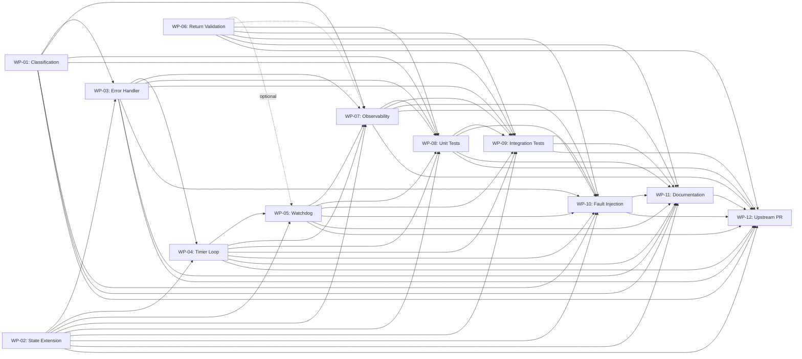

# Implementation Execution Plan — Streaming Failure Recovery

> **Generated:** 2026-07-30
> **Source:** EPIC v3 (`docs/EPIC-Streaming-Recovery-OpenCode-Auto-Resume-v3.md`)
> **Work Packages:** 12 plans in `docs/workpackages/WP-XX-Implementation.md`

---

## 1. Dependency Graph



---

## 2. Implementation Order

### Phase 1: Foundation (PR-1)
| Step | WP | Description | Effort | Dependencies |
|------|----|-------------|--------|--------------|
| 1 | WP-02 | SessionWatch state extension | Low | None |
| 2 | WP-01 | Streaming failure classification | Low | None |

**Rationale:** WP-02 and WP-01 have zero dependencies and can be implemented in any order. WP-02 is listed first because WP-03 needs the `pendingRecovery` fields.

**Parallel opportunity:** WP-01 and WP-02 CAN be implemented in parallel.

### Phase 2: Core Recovery (PR-2)
| Step | WP | Description | Effort | Dependencies |
|------|----|-------------|--------|--------------|
| 3 | WP-03 | Extended session.error handler | Medium | WP-01, WP-02 |
| 4 | WP-04 | Timer loop pending recovery check | Medium | WP-02, WP-03 |

**Rationale:** WP-03 sets `pendingRecovery`; WP-04 consumes it. Strict sequential order required.

### Phase 3: Validation & Escalation (PR-3)
| Step | WP | Description | Effort | Dependencies |
|------|----|-------------|--------|--------------|
| 5 | WP-05 | Watchdog enhancement | High | WP-02, WP-04 |
| 6 | WP-06 | session.prompt() return validation | Low | None (optional diagnostic) |

**Rationale:** WP-05 is the most complex WP. WP-06 is optional — it only adds diagnostic logging of the prompt response.

### Phase 4: Observability (PR-4)
| Step | WP | Description | Effort | Dependencies |
|------|----|-------------|--------|--------------|
| 7 | WP-07 | Observability & diagnostics | Medium | WP-01 through WP-06 |

### Phase 5: Testing (PR-5, PR-6)
| Step | WP | Description | Effort | Dependencies |
|------|----|-------------|--------|--------------|
| 8 | WP-08 | Unit tests | Medium | WP-01 through WP-07 |
| 9 | WP-09 | Integration tests | High | WP-01 through WP-08 |
| 10 | WP-10 | Fault injection tests | High | WP-01 through WP-09 |

### Phase 6: Documentation & Upstream (PR-7, PR-8)
| Step | WP | Description | Effort | Dependencies |
|------|----|-------------|--------|--------------|
| 11 | WP-11 | Documentation | Medium | WP-01 through WP-10 |
| 12 | WP-12 | Upstream PR | Low | WP-01 through WP-11 |

---

## 3. Recommended PR Order

| PR # | WPs | Description | Risk | Review Notes |
|------|-----|-------------|------|--------------|
| PR-1 | WP-01, WP-02 | Classification + state extension | Low | Additive changes only; no runtime behaviour change. Safest first PR. |
| PR-2 | WP-03, WP-04 | Error handler + timer loop | Medium | Core recovery path. Changes `session.error` handler (test carefully). |
| PR-3 | WP-05, WP-06 | Watchdog + return validation | High | Most complex change. Watchdog escalation touches timing-sensitive code. |
| PR-4 | WP-07 | Observability | Low | Additive logging only. Can be reviewed independently. |
| PR-5 | WP-08 | Unit tests | Low | Tests validate PRs 1-3. Can be reviewed after PR-3 merges. |
| PR-6 | WP-09, WP-10 | Integration + fault injection | Medium | End-to-end validation. Requires PR-5 for coverage baselines. |
| PR-7 | WP-11 | Documentation | Low | Pure docs. Can be prepared in parallel but merged last. |
| PR-8 | WP-12 | Final upstream PR | Low | Combines all PRs. Single squashed merge to main. |

---

## 4. Expected Merge Conflicts

### Within the same PR
| Between | File | Cause | Resolution |
|---------|------|-------|------------|
| WP-01 (constants) + WP-02 (interface) | `src/index.ts` | Both add to the top of the file | WP-01 adds constants (~5 lines), WP-02 adds interface fields (~4 lines). Different sections, no conflict if implemented sequentially. |
| WP-03 + WP-04 | `src/index.ts` | WP-03 modifies `handleEvent` (line 1587); WP-04 modifies timer loop (line 1337) | Different functions, no conflict. |

### Between PRs
| Between | File | Cause | Resolution |
|---------|------|-------|------------|
| PR-1 (WP-02) + PR-2 (WP-03) | `src/index.ts` | WP-02 adds interface fields; WP-03 reads them | No conflict — WP-02 adds fields, WP-03 uses them. Sequential PRs. |
| PR-2 (WP-04) + PR-3 (WP-05) | `src/index.ts` | WP-04 adds timer loop check; WP-05 enhances watchdog in `sendContinuePrompt` | Different functions (timer loop vs. `sendContinuePrompt`). No conflict. |
| PR-4 (WP-07) + PR-3 (WP-05) | `src/index.ts` | Both may add log calls in the same functions | Low conflict — adjacent lines only. Easy resolution. |

### Cross-WP conflicts to resolve in the execution plan
| Issue | WPs | Resolution |
|-------|-----|------------|
| `pendingRecovery`, `recoveryAttempts` fields both in WP-02 and WP-05 | WP-02, WP-05 | **WP-02 is authoritative for these fields.** WP-05 must NOT re-add them. WP-05 adds only `watchdogRetryGuard: boolean` (or directly checks `recoveryAttempts < maxRetries` without a guard flag). |
| Test file `src/index.streaming-failure.test.ts` created in two places | WP-01, WP-08 | **WP-01 creates this file.** WP-08 adds tests to it. WP-08's implementation plan must be updated to say "add tests to existing file" not "create new file". |
| SessionWatch tests split across files | WP-02, WP-08 | WP-02 adds inline tests to `src/index.it.test.ts`. WP-08 creates `src/index.session-watch.test.ts`. **Consolidate:** Move WP-02's inline tests into WP-08's new file, or have WP-08 add to `src/index.it.test.ts`. |
| `tests/` directory doesn't exist | WP-03, WP-05 | All test files must use `src/` prefix. **WP-03** and **WP-05** must update their plans to use `src/`. |
| WP-05's `tryAbortAndResume` enhancement claim | WP-05 | **False claim.** WP-04 does NOT enhance `tryAbortAndResume`. WP-05 calls `tryAbortAndResume` as-is. WP-05 must correct its dependency documentation. |
| WP-05's `sendContinuePrompt` extraction claim | WP-05 | **False claim.** WP-02 does NOT extract `sendContinuePrompt`. WP-05 calls `sendContinuePrompt` as-is. WP-05 must correct its documentation. |

---

## 5. Implementation Risk Matrix

| Risk | Likelihood | Impact | Mitigation |
|------|-----------|--------|------------|
| WP-05's watchdog retry causes re-entrancy with timer loop | Medium | High | `w.continuing` guard prevents concurrent `sendContinuePrompt`. Verify in WP-10 fault injection tests. |
| WP-03 change to `session.error` handler breaks existing error handling | Low | High | All existing paths preserved (`MessageAbortedError` first, generic error last). Test every path in WP-09. |
| WP-02 and WP-05 add conflicting SessionWatch fields | Medium | High | **Must resolve before PR-1 merges.** WP-02 is authoritative. WP-05 must not re-add fields. |
| Backoff calculation mismatch between WP-04 timer loop and WP-05 watchdog | Low | Medium | Both use `backoffMs(recoveryAttempts)`. Verify consistency in WP-08. |
| WP-04 pending recovery fires while session is already being recovered by existing mechanisms | Low | Medium | Guard conditions (`continuing`, `userCancelled`, etc.) prevent overlap. Verified in WP-10. |
| `session.prompt()` SDK response structure is unknown (WP-06) | Medium | Low | WP-06 is diagnostic-only. Log raw response; no functional dependency. |
| Test files scattered across `src/` and `tests/` directories | Medium | Low | All test files must use `src/` prefix. Enforce in code review. |
| WP-08 implementation plan creates test files that don't match actual test file names used by WP-01 through WP-07 | Low | Medium | WP-08 must be the LAST implementation WP and verify actual file names exist in the codebase before writing test code. |

---

## 6. Parallel Execution Opportunities

### Can be fully parallel
| WPs | Constraint | Notes |
|-----|------------|-------|
| WP-01 + WP-02 | None | Independent. Different sections of `src/index.ts`. |
| WP-01 + WP-06 | None | WP-06 has no dependencies. |
| WP-02 + WP-06 | None | Independent. |
| WP-11 (draft) + any | None | Documentation can be drafted in parallel with any implementation. |
| WP-12 + any | None | PR preparation can start after all implementations complete. |

### Can be partially parallel
| WPs | Constraint | Notes |
|-----|------------|-------|
| WP-07 + WP-05 | WP-07 depends on WP-05's structure | Observability log lines must match WP-05's control flow, but can be added in the same PR. |
| WP-08 + WP-09 | WP-08 must define test infrastructure | Integration tests depend on unit test patterns. |
| WP-10 + WP-09 | Both are testing | Can be implemented by the same engineer. |

### Must be strictly sequential
| Chain | Reason |
|-------|--------|
| WP-01 → WP-03 | WP-03 uses `isStreamingFailure` from WP-01 |
| WP-02 → WP-03 → WP-04 → WP-05 | WP-03 sets pendingRecovery; WP-04 consumes it; WP-05 enhances escalation |
| WP-05 → WP-07 | WP-07's log entries reference WP-05's control flow |
| WP-01..07 → WP-08 | Unit tests verify implemented code |
| WP-08 → WP-09 | Integration tests build on unit test patterns |
| WP-09 → WP-10 | Fault injection tests extend integration test framework |
| WP-01..10 → WP-11 | Documentation must reflect final implementation |
| WP-01..11 → WP-12 | Upstream PR bundles all work |

---

## 7. Estimated Implementation Effort

| WP | Description | Estimated Hours | Complexity | Risk |
|----|-------------|----------------|------------|------|
| WP-01 | Streaming Failure Classification | 2-3 | Low | Low |
| WP-02 | SessionWatch State Extension | 1-2 | Low | Low |
| WP-03 | Extended session.error Handler | 3-5 | Medium | Medium |
| WP-04 | Timer Loop Pending Recovery Check | 3-5 | Medium | Low |
| WP-05 | Watchdog Enhancement | 6-10 | High | High |
| WP-06 | session.prompt() Return Validation | 2-3 | Low | Low |
| WP-07 | Observability & Diagnostics | 3-5 | Medium | Low |
| WP-08 | Unit Tests | 8-12 | Medium | Low |
| WP-09 | Integration Tests | 10-16 | High | Medium |
| WP-10 | Fault Injection Tests | 8-12 | High | Medium |
| WP-11 | Documentation | 4-6 | Medium | Low |
| WP-12 | Upstream PR | 2-4 | Low | Low |
| **Total** | | **52-83** | | |

### Key Assumptions
- Developer is familiar with the codebase (1-2 days ramp-up included in WP estimates)
- Testing is included in each WP estimate (WP-08, WP-09, WP-10 are pure test WPs)
- Code review adds 20-30% overhead (not included in estimates)
- WP-05's 6-10h estimate assumes the developer resolves the overlapping SessionWatch fields correctly

---

## 8. Consistency Corrections (Must Apply Before Implementation)

The following corrections resolve issues found during the cross-WP review. These must be applied to the WP implementation plans before development begins.

### Correction 1: WP-05 must NOT re-add `pendingRecovery` and `recoveryAttempts`
**Affected:** WP-05 Implementation Plan, SessionWatch fields section
**Action:** WP-02 adds `pendingRecovery`, `pendingRecoveryReason`, `pendingRecoveryAt`, `recoveryAttempts`. WP-05 must reference these existing fields and add ONLY `watchdogRetryGuard: boolean` (or none if a simpler approach is used — directly check `recoveryAttempts < maxRetries` without a guard flag).

### Correction 2: WP-05 must update `resetSessionFlags` for its new field
**Affected:** WP-05 Implementation Plan
**Action:** Add a step to clear `watchdogRetryGuard` in `resetSessionFlags` (and optionally in `resetIdleFlags`).

### Correction 3: All test files must use `src/` prefix
**Affected:** WP-03, WP-05 Implementation Plans
**Action:** Change `tests/wp03-session-error-handler.test.ts` → `src/index.session-error-handler.test.ts` and `tests/wp05-watchdog.test.ts` → `src/index.watchdog.test.ts`.

### Correction 4: WP-05 dependencies corrected
**Affected:** WP-05 Implementation Plan, External Dependencies section
**Actions:**
- Remove "WP-02 extracts `sendContinuePrompt` as standalone function" — FALSE. WP-02 only adds fields.
- Remove "WP-04 enhances `tryAbortAndResume`" — FALSE. WP-04 only adds timer loop check.
- WP-05 calls `sendContinuePrompt` and `tryAbortAndResume` as-is, from the existing implementations.

### Correction 5: WP-01's External Dependencies corrected
**Affected:** WP-01 Implementation Plan
**Action:** Change "WP-02 will call `isStreamingFailure`" to "WP-03 will call `isStreamingFailure`". WP-02 is independent — it never calls `isStreamingFailure`.

### Correction 6: WP-08 test file coordination
**Affected:** WP-08 Implementation Plan
**Action:** WP-08 must check which test files were actually created by WP-01 through WP-07 before creating new ones. Specifically:
- `src/index.streaming-failure.test.ts` — created by WP-01; WP-08 adds tests (does NOT create)
- `src/index.session-watch.test.ts` — consolidate with WP-02's inline tests in `src/index.it.test.ts`
- `src/index.watchdog.test.ts` — created by WP-05; WP-08 adds tests (does NOT create)

### Correction 7: SessionWatch test consolidation
**Affected:** WP-02, WP-08
**Action:** Choose one location for SessionWatch tests:
- **Recommended:** WP-02 adds inline tests to `src/index.it.test.ts` (existing pattern). WP-08 creates `src/index.session-watch.test.ts` for the full suite and moves WP-02's inline tests there.

---

## 9. File Ownership Matrix

| Source File | Owned By | Also Touched By |
|-------------|----------|-----------------|
| `src/index.ts` — SessionWatch interface | WP-02 | WP-05 (must reference, not re-add) |
| `src/index.ts` — Default constants | WP-01 | None |
| `src/index.ts` — `ensureWatch()` | WP-02 | None |
| `src/index.ts` — `resetSessionFlags()` | WP-02 | WP-05 (add clear for new fields) |
| `src/index.ts` — `resetIdleFlags()` | WP-02 | None |
| `src/index.ts` — `isStreamingFailure()` | WP-01 | None |
| `src/index.ts` — `sendContinuePrompt()` watchdog | WP-05 | WP-06 (add return capture), WP-07 (add logging) |
| `src/index.ts` — `handleEvent` session.error case | WP-03 | WP-07 (add logging) |
| `src/index.ts` — Timer loop idle recheck | WP-04 | WP-07 (add logging) |
| `src/index.streaming-failure.test.ts` | WP-01 (create) | WP-08 (add tests) |
| `src/index.session-watch.test.ts` | WP-08 (create) | None |
| `src/index.watchdog.test.ts` | WP-05 (create) | WP-08 (add tests) |
| `src/index.error-handler.test.ts` | WP-03 (create) | None |
| `src/index.integration.test.ts` | WP-09 | None |
| `src/index.fault-injection.test.ts` | WP-10 (create) | None |
| `README.md` | WP-11 | None |
| `docs/architecture/recovery-flow.md` | WP-11 | None |
| `docs/audits/architecture-audit.md` | WP-11 | None |
| `docs/examples/streaming-failure-recovery.md` | WP-11 (create) | None |

**Key principle:** Each source file has exactly ONE "Owner" responsible for its content. Other WPs may touch the same file but only in additive, non-conflicting ways.

---

## 10. Final Implementation Roadmap

```
Week 1          Week 2          Week 3          Week 4          Week 5
├────────┤      ├────────┤      ├────────┤      ├────────┤      ├────────┤
PR-1 (WP-01+02) PR-2 (WP-03+04) PR-3 (WP-05+06) PR-4 (WP-07)   PR-7 (WP-11)
├────────┤                      ├────────┤                      ├────────┤
Foundation       Core Recovery   Validation       Observability   Docs
                 
                 PR-5 (WP-08)    PR-6 (WP-09+10)                 PR-8 (WP-12)
                 ├────────┤      ├────────┤                      ├────────┤
                 Unit Tests      Integration +                   Final PR
                                 Fault Injection
```

### Milestones

| Milestone | Target | Deliverables | Gate |
|-----------|--------|--------------|------|
| M1: Foundation | End of Week 1 | `isStreamingFailure()` function, `pendingRecovery` fields, plugin config options | All PR-1 tests pass |
| M2: Core Recovery | End of Week 2 | Streaming failure detected and recovery initiated via timer loop | Manual end-to-end verification |
| M3: Validation | End of Week 3 | Watchdog escalates on failure, prompt return captured | All PR-3 tests pass |
| M4: Observable | End of Week 4 | All recovery steps logged, structured diagnostics | Log output verified |
| M5: Verified | End of Week 5 | Unit, integration, and fault injection tests all pass | >95% coverage, all scenarios tested |
| M6: Shipped | End of Week 5 | Documentation updated, upstream PR submitted | PR accepted, CI passes |

---

## 11. Branch Strategy

### Working branches
```
main
├── feat/streaming-classification        # PR-1: WP-01 + WP-02
├── feat/streaming-core-recovery         # PR-2: WP-03 + WP-04 (branch from feat/streaming-classification)
├── feat/streaming-watchdog              # PR-3: WP-05 + WP-06 (branch from feat/streaming-core-recovery)
├── feat/streaming-observability         # PR-4: WP-07 (branch from feat/streaming-watchdog)
├── feat/streaming-unit-tests            # PR-5: WP-08 (branch from feat/streaming-observability)
├── feat/streaming-integration-tests     # PR-6: WP-09 + WP-10 (branch from feat/streaming-unit-tests)
├── feat/streaming-docs                  # PR-7: WP-11 (can branch from main, merge last)
└── feat/streaming-final                 # PR-8: WP-12 (merge all previous branches)
```

### Merge strategy
- Each PR merges into `main` after review
- Each subsequent PR branches from `main` (not from the previous branch)
- This ensures each PR is independently reviewable and testable
- The final PR (WP-12) is a squash merge of all changes into a clean commit

---

## 12. Review Sequence

### Per-PR Review
Each PR must pass:
1. **Lint check:** `bun run lint` (or equivalent)
2. **Type check:** `bun run typecheck` (or equivalent)
3. **Existing tests:** All existing `src/index.*.test.ts` tests pass
4. **New tests:** All new tests added in this PR pass
5. **Manual verification:** The specific acceptance criteria from each WP are verified

### Final Review (WP-12)
Before the upstream PR:
1. All PRs 1-7 merged to main
2. Full test suite passes
3. The consistency corrections (Section 8) applied
4. EPIC v3 referenced in PR description
5. Commit history squashed to meaningful commits

---

## Appendix A: Quick Reference — Where to Start

| You are... | Start with... | Then... |
|------------|---------------|---------|
| Implementing WP-01 | `docs/workpackages/WP-01-Implementation.md` | Read `src/index.ts` lines 52-65 (constants), 245 (dbg), 270-274 (log) |
| Implementing WP-02 | `docs/workpackages/WP-02-Implementation.md` | Read `src/index.ts` lines 20-50 (interface), 276-313 (ensureWatch), 699-727 (reset functions) |
| Implementing WP-03 | `docs/workpackages/WP-03-Implementation.md` + Correction 5 | Read `src/index.ts` lines 1587-1616 (session.error handler) |
| Implementing WP-04 | `docs/workpackages/WP-04-Implementation.md` | Read `src/index.ts` lines 1337-1362 (idle recheck loop), 383-385 (backoffMs) |
| Implementing WP-05 | `docs/workpackages/WP-05-Implementation.md` + Corrections 1, 2, 3, 4 | Read `src/index.ts` lines 426-517 (sendContinuePrompt), 1084-1122 (tryAbortAndResume) |
| Implementing WP-06 | `docs/workpackages/WP-06-Implementation.md` | Read `src/index.ts` lines 477-484, 495-499 (prompt calls) |
| Implementing WP-07 | `docs/workpackages/WP-07-Implementation.md` | Read EPIC v3 Section 12.1 (log table) |
| Implementing WP-08 | `docs/workpackages/WP-08-Implementation.md` + Corrections 3, 6, 7 | Read existing test files for patterns |
| Implementing WP-09 | `docs/workpackages/WP-09-Implementation.md` | Read `src/index.integration.test.ts` for patterns |
| Implementing WP-10 | `docs/workpackages/WP-10-Implementation.md` | Read `src/index.integration.test.ts` for mock patterns |
| Implementing WP-11 | `docs/workpackages/WP-11-Implementation.md` | Read existing docs for style |
| Implementing WP-12 | `docs/workpackages/WP-12-Implementation.md` | Read EPIC v3 Section 19 (PR strategy) |

---

## Appendix B: Consistency Issue Tracker

| # | Status | WPs | Description | Resolution |
|---|--------|-----|-------------|------------|
| C1 | UNRESOLVED | WP-05 | Claims WP-02 extracts `sendContinuePrompt` (false) | WP-05 must correct its dependencies |
| C2 | UNRESOLVED | WP-05 | Claims WP-04 enhances `tryAbortAndResume` (false) | WP-05 must correct its dependencies |
| C3 | UNRESOLVED | WP-02, WP-05 | Overlapping SessionWatch fields | WP-02 is authoritative; WP-05 must not re-add |
| C4 | UNRESOLVED | WP-05 | Missing `resetSessionFlags` update | WP-05 must add this step |
| C5 | UNRESOLVED | WP-03, WP-05 | Uses `tests/` instead of `src/` | Rename paths to `src/` prefix |
| C6 | UNRESOLVED | WP-01 | Incorrect dependency list | Correct "Later WPs Depending" section |
| C7 | UNRESOLVED | WP-08 | Claims to create file WP-01 already creates | WP-08 must reference WP-01's existing file |
| C8 | UNRESOLVED | WP-02, WP-08 | Split SessionWatch test locations | Consolidate into one test file |

**All issues above must be resolved before implementation begins.** The implementation plans in `docs/workpackages/` should be updated with these corrections as the first step of each WP's implementation.
